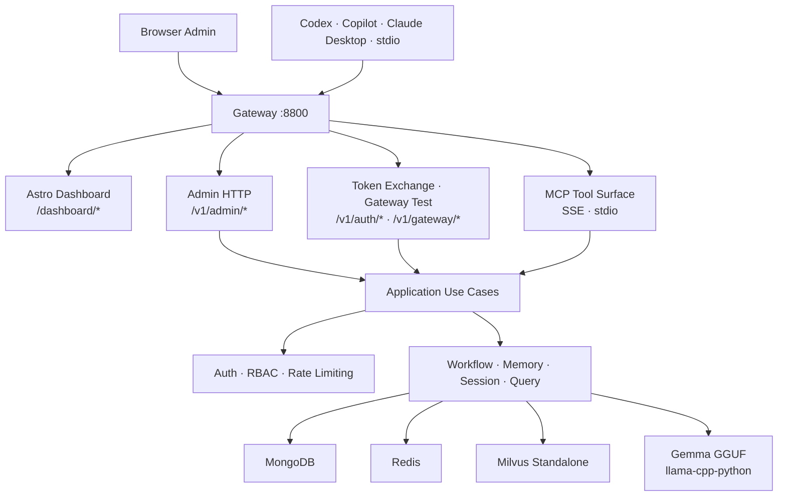

# Minder


**Minder** is a self-hosted MCP server for repository-aware code assistance — semantic search, workflow governance, memory, client onboarding, and session management over `SSE` and `stdio`.

---

## Contents

- [Architecture](#architecture)
- [Prerequisites](#prerequisites)
- [Quick Start](#quick-start)
- [Operator Flows](#operator-flows)
- [Configuration](#configuration)
- [Testing](#testing)
- [Documentation](#documentation)

---

## Architecture



### Runtime layers

```
Presentation  →  src/minder/presentation/http/admin   (HTTP routes, DTOs)
                 src/dashboard                         (Astro admin console)
Application   →  src/minder/application/admin          (use cases)
Domain        →  src/minder/models                     (entities, value objects)
Infrastructure→  src/minder/store                      (MongoDB · Milvus · Redis adapters)
               src/minder/auth                         (principals, middleware, rate limiter)
               src/minder/graph                        (LangGraph pipeline, nodes)
```

### Runtime stack

| Service           | Role                                           | Default port |
| ----------------- | ---------------------------------------------- | ------------ |
| Minder API        | MCP server, admin HTTP, token exchange         | `8800`       |
| Astro Dashboard   | Admin console (dev: standalone, prod: proxied) | `8808` (dev) |
| MongoDB 7         | Operational store — users, clients, sessions   | `27017`      |
| Redis 7           | Cache, rate limiting, client token sessions    | `6379`       |
| Milvus Standalone | Vector search for documents, code, errors      | `19530`      |

### MCP tool surface

| Tool                   | Description                                    |
| ---------------------- | ---------------------------------------------- |
| `minder_query`         | Full RAG pipeline — reason + retrieve + verify |
| `minder_search_code`   | Semantic code search across indexed repos      |
| `minder_search_errors` | Semantic error search with resolution hints    |
| `minder_search`        | General document search                        |
| `minder_memory_recall` | Retrieve from persistent memory store          |
| `minder_workflow_get`  | Inspect current workflow state                 |
| `minder_workflow_step` | Advance a workflow step                        |

---

## Prerequisites

| Requirement      | Version                        |
| ---------------- | ------------------------------ |
| Python           | `≥ 3.14`                       |
| uv               | latest                         |
| Docker + Compose | v2+                            |
| Bun              | `1.2.21+` (dashboard dev only) |

---

## Quick Start

### 1. Download GGUF models

```bash
./scripts/download_models.sh
```

Models are written to `~/.minder/models`.

### 2. Set up environment files

```bash
# Backend
cp .env.example .env

# Dashboard (only needed for local dev server)
cp src/dashboard/.env.example src/dashboard/.env
```

Default values target the local split-dev layout: Minder on `8800`, Astro on `8808`.

### 3. Start infrastructure services

```bash
docker compose -f docker/docker-compose.local.yml up -d
```

Starts MongoDB, Redis, Milvus Standalone (with etcd and MinIO).

### 4. Start the backend

```bash
PYTHONPATH=src UV_CACHE_DIR=.uv-cache uv run python -m minder.server
```

### 5. Start the dashboard (dev)

```bash
cd src/dashboard
bun install
bun run dev          # http://localhost:8808/dashboard
```

Or build static assets and let Minder serve them on port `8800`:

```bash
cd src/dashboard && bun run build
```

### 6. Initialize the first admin

Open [`http://localhost:8800/dashboard/setup`](http://localhost:8800/dashboard/setup) in a browser.

Enter username, email, and display name. Minder returns the bootstrap admin API key (`mk_…`) **exactly once** — save it before navigating away.

### 7. Sign in

Open [`http://localhost:8800/dashboard/login`](http://localhost:8800/dashboard/login) and authenticate with the `mk_…` key. A session cookie is set on success.

---

## Operator Flows

### Create and onboard an MCP client

1. Sign into the dashboard and open **Client Registry**.
2. Fill the **Create Client** form — name, slug, tool scopes, repo scopes.
3. Minder issues a `mkc_…` client API key **once**. Copy it immediately.
4. Use the key in your MCP client:

| Transport   | Auth mechanism                              |
| ----------- | ------------------------------------------- |
| SSE         | `X-Minder-Client-Key: mkc_…` header         |
| stdio       | `MINDER_CLIENT_API_KEY=mkc_…` env variable  |
| OAuth-style | `POST /v1/auth/token-exchange` with the key |

5. Optionally copy a generated onboarding snippet from the client detail page (Codex, Copilot-style MCP, or Claude Desktop).

### Rotate or revoke a client key

From the client detail page, use **Rotate Key** (issues a new key, invalidates the old) or **Revoke** (permanently blocks the client). Both actions are recorded in the audit log.

### Recover admin access

If the admin API key is lost:

```bash
PYTHONPATH=src UV_CACHE_DIR=.uv-cache uv run python scripts/reset_admin_api_key.py \
  --username <admin-username>
```

The previous key is invalidated immediately and an audit event is written.

### Production deployment

```bash
docker compose -f docker/docker-compose.yml up -d
```

The production compose runs `gateway` (Caddy), `minder-api`, and `dashboard` as separate services with a single public origin on `:8800`.

---

## Configuration

Minder loads configuration from `minder.toml` first, then environment overrides (prefix `MINDER_`).

Key variables:

| Variable                                 | Default                                          | Description               |
| ---------------------------------------- | ------------------------------------------------ | ------------------------- |
| `MINDER_SERVER__PORT`                    | `8800`                                           | HTTP listen port          |
| `MINDER_MONGODB__URI`                    | `mongodb://localhost:27017`                      | MongoDB connection string |
| `MINDER_REDIS__URI`                      | `redis://localhost:6379/0`                       | Redis connection string   |
| `MINDER_VECTOR_STORE__URI`               | `http://localhost:19530`                         | Milvus endpoint           |
| `MINDER_LLM__MODEL_PATH`                 | `~/.minder/models/gemma-4-e2b-it-Q8_0.gguf`      | Local LLM model           |
| `MINDER_EMBEDDING__MODEL_PATH`           | `~/.minder/models/embeddinggemma-300M-Q8_0.gguf` | Embedding model           |
| `MINDER_CACHE__PROVIDER`                 | `redis`                                          | `redis` or `lru`          |
| `MINDER_WORKFLOW__ORCHESTRATION_RUNTIME` | `langgraph`                                      | `langgraph` or `simple`   |

---

## Testing

Run the full test suite:

```bash
UV_CACHE_DIR=.uv-cache uv run pytest
```

Gate tests by phase:

```bash
uv run pytest tests/integration/test_phase3_gate.py   # Phase 3 acceptance
uv run pytest tests/e2e/test_phase4_gateway_auth.py   # Phase 4 gateway auth
uv run pytest tests/integration/test_phase4_3_console_gate.py  # P4.3 console
```

Infrastructure-dependent tests (Milvus, MongoDB, Redis) require Docker services running.

---

## Documentation

| Document                                                            | Description                                  |
| ------------------------------------------------------------------- | -------------------------------------------- |
| [System Design](docs/system-design.md)                              | Canonical architecture reference             |
| [Project Plan](docs/PLAN.md)                                        | Phased delivery plan and current focus       |
| [Project Progress](docs/PROJECT_PROGRESS.md)                        | Per-task status tracker                      |
| [Task Breakdown](docs/TASK_BREAKDOWN.md)                            | Full task catalog with requirements          |
| [Local Setup Guide](docs/guides/local-setup.md)                     | Step-by-step local environment setup         |
| [Admin & Client Onboarding](docs/guides/admin-client-onboarding.md) | Admin setup and client provisioning          |
| [Production Deployment](docs/guides/production-deployment.md)       | Production compose and gateway configuration |
| [Gateway Auth Design](docs/design/mcp-gateway-auth-dashboard.md)    | Phase 4.0 gateway auth design                |
