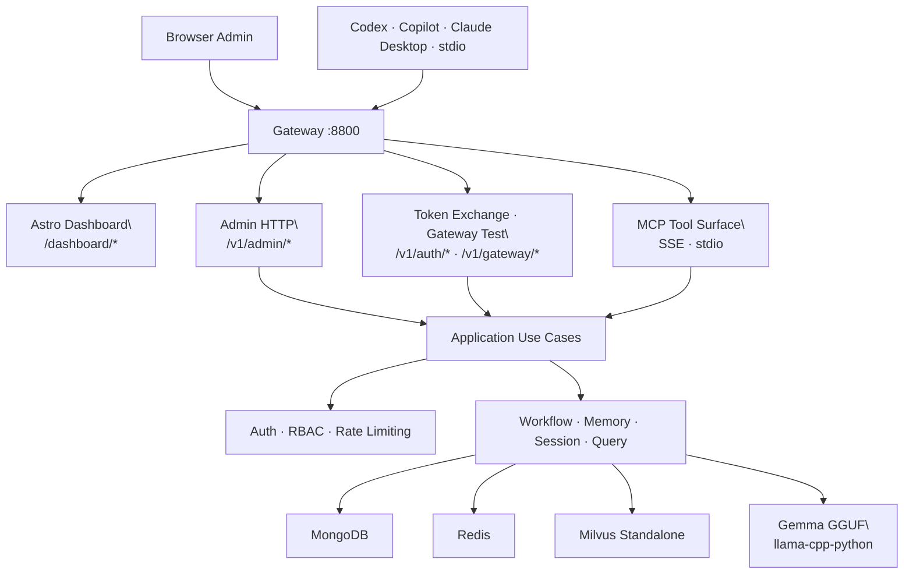

# Minder

<p align="center">
  
</p>

<p align="center">
  <strong>Self-hosted MCP platform for repo-aware engineering intelligence.</strong><br/>
  Search smarter, govern workflows, persist memory, onboard clients, and run over <code>SSE</code> or <code>stdio</code>.
</p>

---

## Why Minder

- Repository-aware retrieval across code, docs, and historical errors.
- Workflow governance that keeps delivery phases explicit and auditable.
- Persistent memory and session context for long-running engineering tasks.
- Built-in admin dashboard plus API-first client onboarding.
- Single platform for Codex, Copilot-style MCP clients, Claude Desktop, and CLI automation.

---

## Quick Start (Local in Minutes)

### 1) Download GGUF models

```bash
./scripts/download_models.sh
```

Models are saved to `~/.minder/models`.

### 2) Prepare environment

```bash
cp .env.example .env
cp src/dashboard/.env.example src/dashboard/.env
```

Default local layout:
- Minder API/Gateway: `http://localhost:8800`
- Dashboard dev server: `http://localhost:8808/dashboard`

### 3) Start infra services

```bash
docker compose -f docker/docker-compose.local.yml up -d
```

This starts MongoDB, Redis, Milvus Standalone (plus etcd + MinIO).

### 4) Run backend

```bash
PYTHONPATH=src UV_CACHE_DIR=.uv-cache uv run python -m minder.server
```

### 5) Run dashboard (dev mode)

```bash
cd src/dashboard
bun install
bun run dev
```

Or build static assets for serving via Minder on `:8800`:

```bash
cd src/dashboard && bun run build
```

### 6) Bootstrap first admin

Open [http://localhost:8800/dashboard/setup](http://localhost:8800/dashboard/setup) and create the first admin.

Minder returns the bootstrap API key (`mk_...`) exactly once. Save it immediately.

### 7) Sign in

Open [http://localhost:8800/dashboard/login](http://localhost:8800/dashboard/login) and authenticate with the `mk_...` key.

---

## System Architecture



### Clean runtime layers

```text
Presentation   -> src/minder/presentation/http/admin   (HTTP routes, DTOs)
                 src/dashboard                         (Astro admin console)
Application    -> src/minder/application/admin         (use cases)
Domain         -> src/minder/models                    (entities, value objects)
Infrastructure -> src/minder/store                     (MongoDB, Milvus, Redis adapters)
                 src/minder/auth                       (principals, middleware, rate limiter)
                 src/minder/graph                      (LangGraph pipeline, nodes)
```

### Runtime stack

| Service | Role | Default Port |
| --- | --- | --- |
| Minder API | MCP server, admin HTTP, token exchange | `8800` |
| Astro Dashboard | Admin console (dev standalone, prod proxied) | `8808` (dev) |
| MongoDB 7 | Users, clients, sessions | `27017` |
| Redis 7 | Cache, rate limiting, token sessions | `6379` |
| Milvus Standalone | Vector index for docs/code/errors | `19530` |

---

## MCP Tool Surface

| Tool | Description |
| --- | --- |
| `minder_query` | End-to-end RAG pipeline: retrieve + reason + verify |
| `minder_search_code` | Semantic code retrieval across indexed repositories |
| `minder_search_errors` | Error retrieval with troubleshooting context |
| `minder_search` | General semantic search over project knowledge |
| `minder_memory_recall` | Retrieve persisted memory entries |
| `minder_workflow_get` | Read current workflow state |
| `minder_workflow_step` | Move workflow to the next step |

---

## CLI Distribution

Install from PyPI:

```bash
uv tool install minder
# or
pipx install minder
```

Typical flow:

```bash
minder login --client-key mkc_your_client_key --server-url http://localhost:8800/sse
minder install-ide --target vscode --target claude-code
minder sync --repo-id <repository-uuid>
```

Highlights:
- `minder install-ide` scaffolds repo-local MCP/instruction assets for VS Code, Cursor, and Claude Code.
- `minder sync` auto-detects cross-repo `branch_relationships` via `.gitmodules` and optional `.minder/branch-topology.toml`.

Update commands:

```bash
minder check-update
minder self-update --component cli
minder self-update --component server
```

`self-update --component server` uses PowerShell installer on Windows and bash installer on macOS/Linux.

---

## Operator Playbooks

### Onboard an MCP client

1. Open **Client Registry** in dashboard.
2. Create client with name, slug, tool scopes, repo scopes.
3. Save the issued key (`mkc_...`) immediately (shown once).
4. Use the key via:

| Transport | Auth Mechanism |
| --- | --- |
| SSE | `X-Minder-Client-Key: mkc_...` header |
| stdio | `MINDER_CLIENT_API_KEY=mkc_...` env var |
| OAuth-style | `POST /v1/auth/token-exchange` with client key |

### Rotate or revoke key

From client detail page:
- **Rotate Key**: issues new key and invalidates old key.
- **Revoke**: permanently blocks client.

Both actions are audit logged.

### Recover admin access

```bash
PYTHONPATH=src UV_CACHE_DIR=.uv-cache uv run python scripts/reset_admin_api_key.py \
  --username <admin-username>
```

### Production deployment

```bash
docker compose -f docker/docker-compose.yml up -d
```

Production topology runs `gateway`, `minder-api`, and `dashboard` behind a single public origin (`:8800`).

---

## Configuration

Config load order:
1. `minder.toml`
2. `MINDER_` environment overrides

Key variables:

| Variable | Default | Purpose |
| --- | --- | --- |
| `MINDER_SERVER__PORT` | `8800` | HTTP listen port |
| `MINDER_MONGODB__URI` | `mongodb://localhost:27017` | MongoDB URI |
| `MINDER_REDIS__URI` | `redis://localhost:6379/0` | Redis URI |
| `MINDER_VECTOR_STORE__URI` | `http://localhost:19530` | Milvus endpoint |
| `MINDER_LLM__MODEL_PATH` | `~/.minder/models/gemma-4-e2b-it-Q8_0.gguf` | Local LLM model |
| `MINDER_EMBEDDING__MODEL_PATH` | `~/.minder/models/embeddinggemma-300M-Q8_0.gguf` | Embedding model |
| `MINDER_CACHE__PROVIDER` | `redis` | `redis` or `lru` |
| `MINDER_WORKFLOW__ORCHESTRATION_RUNTIME` | `langgraph` | `langgraph` or `simple` |

---

## Prerequisites

| Requirement | Version |
| --- | --- |
| Python | `>= 3.14` |
| uv | latest |
| Docker + Compose | v2+ |
| Bun | `1.2.21+` (dashboard dev only) |

---

## Testing

Run all tests:

```bash
UV_CACHE_DIR=.uv-cache uv run pytest
```

Phase-specific gates:

```bash
uv run pytest tests/integration/test_phase3_gate.py
uv run pytest tests/e2e/test_phase4_gateway_auth.py
uv run pytest tests/integration/test_phase4_3_console_gate.py
```

Note: integration tests that hit Milvus/MongoDB/Redis require Docker services running.

---

## Documentation Index

- [System Design](docs/system-design.md)
- [Project Plan](docs/PLAN.md)
- [Project Progress](docs/PROJECT_PROGRESS.md)
- [Task Breakdown](docs/TASK_BREAKDOWN.md)
- [Local Setup Guide](docs/guides/local-setup.md)
- [Minder CLI Guide](docs/guides/minder-cli.md)
- [Admin & Client Onboarding](docs/guides/admin-client-onboarding.md)
- [Production Deployment](docs/guides/production-deployment.md)
- [Gateway Auth Design](docs/design/mcp-gateway-auth-dashboard.md)
