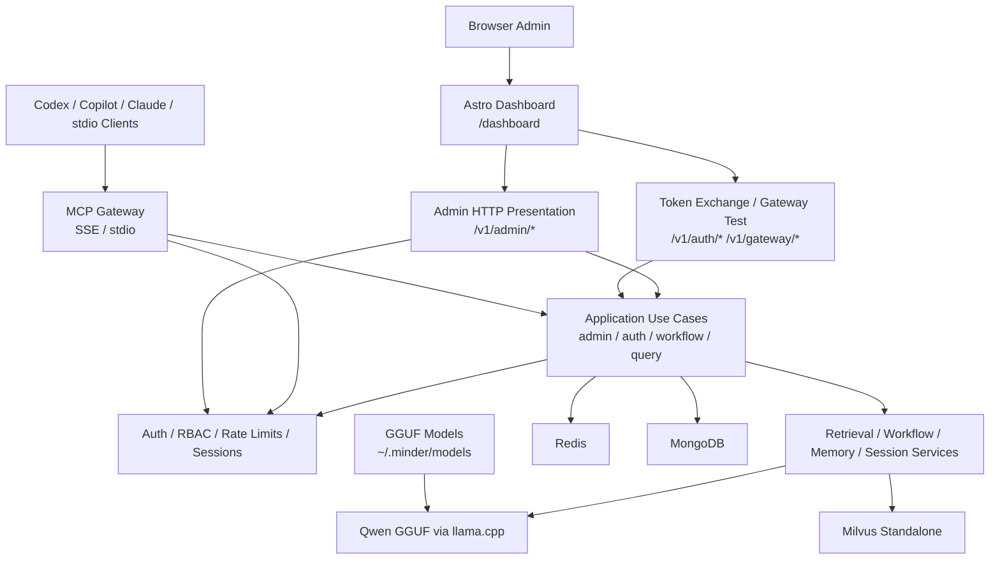
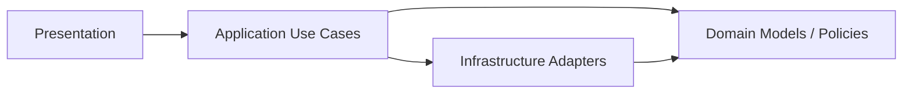

# Minder


Minder is an MCP-first engineering assistant platform for repository search, workflow guidance, memory, session state, and low-friction client onboarding.

The local and self-hosted stack is built around:

- `Minder` over `SSE` or `stdio`
- `MongoDB` for operational data
- `Redis` for cache, rate limiting, and client sessions
- `Milvus Standalone` for vector search
- local `Qwen GGUF` models through `llama-cpp-python`

## What You Get

- MCP tools for `query`, `search`, `memory`, `workflow`, `session`, and `auth`
- client onboarding flow for `Codex`, `Copilot-style MCP clients`, and `Claude Desktop`
- admin/client API-key model with token exchange
- repository-aware retrieval and workflow enforcement
- local Docker stack for development

## Local Stack

The default local backend entrypoint is:

- SSE server: [http://localhost:8800/sse](http://localhost:8800/sse)
- Dashboard route: [http://localhost:8800/dashboard](http://localhost:8800/dashboard)
- Token exchange API: [http://localhost:8800/v1/auth/token-exchange](http://localhost:8800/v1/auth/token-exchange)

Note:

- In containerized production, a gateway service keeps `:8800` as the single public origin and routes `/dashboard/*` to a dedicated Astro service plus `/v1/*` and MCP routes to the Minder API service.
- In local frontend development, Astro can run separately on `8808` and call Minder on `8800` through `API_URL`.

## Quick Start

### 1. Download local models

```bash
./scripts/download_models.sh
```

Expected output:

```text
models ready in /Users/<you>/.minder/models
```

### 1a. Prepare local env files

Backend:

```bash
cp .env.example .env
```

Frontend:

```bash
cp src/dashboard/.env.example src/dashboard/.env
```

These defaults are already set for local split development:

- Minder backend on `8800`
- Astro dev server on `8808`
- dashboard API calls to `http://localhost:8800`

### 2. Start the local infrastructure

```bash
docker compose -f docker/docker-compose.local.yml up -d
```

If you want to build the dashboard bundle outside Docker:

```bash
cd src/dashboard
bun install
bun run build
```

Frontend baseline:

- Astro `6.1.4`
- Bun `1.2.21`
- Node `22.12+` if you run frontend tooling without Bun

Services started by this stack:

- `mongodb` on port `27017`
- `redis` on port `6379`
- `milvus-standalone` on port `19530`
- `etcd` and `minio` as Milvus dependencies

Local note:

- `docker-compose.local.yml` is infra-only for local debugging.
- run Minder locally with `uv run python -m minder.server`.
- run Astro locally with `bun run dev` when you want dashboard hot reload.
- the production stack is the default [docker/docker-compose.yml](docker/docker-compose.yml).

### 2a. Run Minder and Astro against the local infrastructure

Run the backend and the dashboard separately against the Docker services above.

Backend:

```bash
PYTHONPATH=src UV_CACHE_DIR=.uv-cache uv run python -m minder.server
```

Frontend:

```bash
cd src/dashboard
bun install
bun run dev
```

In this mode:

- Astro dev server runs on [http://localhost:8808/dashboard](http://localhost:8808/dashboard)
- Minder APIs stay on [http://localhost:8800](http://localhost:8800)
- dashboard requests go cross-origin to `API_URL` from `src/dashboard/.env`
- Astro bridges `API_URL` into the client bundle as `PUBLIC_API_URL`
- onboarding snippets use the backend origin derived from the incoming API request, so local snippets point to the Minder backend on `8800`

### 3. Create the first admin in the browser

Open:

- [http://localhost:8800/dashboard/setup](http://localhost:8800/dashboard/setup)

Fill in:

- email
- username
- display name

After submission, Minder redirects to a one-time setup completion screen and shows the bootstrap admin API key exactly once.

Save the `mk_...` value. That is the admin bootstrap key.

### 4. Open the admin login page

Open:

- [http://localhost:8800/dashboard/login](http://localhost:8800/dashboard/login)

Sign in with the `mk_...` admin API key from the previous step. Minder stores the admin browser session in an `HttpOnly` cookie.

### 5. Continue with the onboarding guide

Use the step-by-step guide here:

- [Local Setup Guide](docs/guides/local-setup.md)
- [Admin and Client Onboarding Guide](docs/guides/admin-client-onboarding.md)
- [Production Deployment Guide](docs/guides/production-deployment.md)

## Operator Flows

### Browser admin onboarding

1. Start the Docker stack.
2. Open [http://localhost:8800/dashboard/setup](http://localhost:8800/dashboard/setup) on a fresh deployment.
3. Save the one-time `mk_...` admin API key.
4. Open [http://localhost:8800/dashboard/login](http://localhost:8800/dashboard/login) and sign in.
5. Create one MCP client per real consumer directly from the dashboard.

### Client onboarding

1. Create a client and capture its `mkc_...` client API key.
2. Use one of these auth modes:
   - `SSE`: send `X-Minder-Client-Key: mkc_...`
   - `stdio`: export `MINDER_CLIENT_API_KEY=mkc_...`
   - compatibility mode: exchange `mkc_...` at [`/v1/auth/token-exchange`](http://localhost:8800/v1/auth/token-exchange)
3. Load the generated onboarding template for `Codex`, `Copilot-style MCP`, or `Claude Desktop`.

### Admin recovery

If the admin API key is lost, rotate it with:

```bash
PYTHONPATH=src UV_CACHE_DIR=.uv-cache uv run python scripts/reset_admin_api_key.py \
  --username admin
```

The old admin API key becomes invalid immediately, and Minder writes an audit event for the rotation.

## Documentation Map

- [Local Setup Guide](docs/guides/local-setup.md)
- [Admin and Client Onboarding Guide](docs/guides/admin-client-onboarding.md)
- [Production Deployment Guide](docs/guides/production-deployment.md)
- [System Design](docs/system-design.md)
- [Phase 4.1 Requirements](docs/requirements/p4_1_dashboard_setup_and_direct_auth.md)
- [Gateway Auth and Dashboard Design](docs/design/mcp-gateway-auth-dashboard.md)
- [Task Breakdown](docs/TASK_BREAKDOWN.md)
- [Project Progress](docs/PROJECT_PROGRESS.md)
- [Project Plan](docs/PLAN.md)

## Architecture

Canonical reference:

- [System Design](docs/system-design.md)



### Runtime Layers

See also:

- [System Design](docs/system-design.md)



### Project Layout

See the consolidated architecture document:

- [System Design](docs/system-design.md)

- [`src/dashboard`](src/dashboard): Astro admin console served by the Python app
- [`src/minder/presentation/http/admin`](src/minder/presentation/http/admin): HTTP presentation layer
- [`src/minder/application/admin`](src/minder/application/admin): admin use cases and DTOs
- [`src/minder/auth`](src/minder/auth): auth, principals, middleware, rate limits
- [`src/minder/tools`](src/minder/tools): MCP tool surface
- [`src/minder/store`](src/minder/store): MongoDB/relational/vector/cache adapters

`routes.py` still exists in the admin HTTP package because it is the composition boundary for the presentation layer. Details now live in [System Design](docs/system-design.md).

## Runtime Notes

- Local model files are expected in `~/.minder/models`
- The dev stack defaults to port `8800`
- Minder loads root `.env` automatically
- `LangGraph`, `llama-cpp-python`, and `LiteLLM` are wired with runtime auto-detection
- The admin console ships as an Astro runtime from [src/dashboard](src/dashboard); in containerized production it runs behind a gateway proxy that keeps `/dashboard` on the same public origin.
- Local frontend development can instead run Astro on `8808` with `src/dashboard/.env` setting `API_URL=http://localhost:8800`.
- Browser-native client registry, detail, rotate/revoke, onboarding snippets, activity, and connection testing are all available under `/dashboard`.
- Production compose now uses `gateway`, `dashboard`, and `minder-api` services instead of baking Astro assets into the backend runtime.
- `Phase 4.1`, `Phase 4.2`, and `Phase 4.3` are implemented and covered by tests.

## Validation

Core quality gate used during development:

```bash
UV_CACHE_DIR=.uv-cache uv run pytest
```

## Current UX Limits

- Admin bootstrap is now browser-first through `/dashboard/setup`, and admin API-key recovery is available through `scripts/reset_admin_api_key.py`
- The Astro console covers client onboarding and client management. Broader workflow/repository/observability screens are still later `Phase 4` work.
- Full workflow/repository/user management UI belongs to broader `Phase 4`, not the completed `Phase 4.0` onboarding slice
