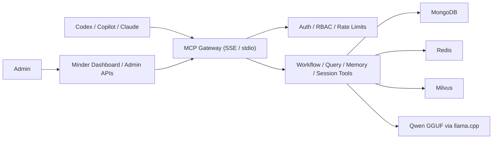

# Minder

Minder is an MCP-first engineering assistant platform for repository search, workflow guidance, memory, session state, and client onboarding.

It runs as a local or self-hosted stack with:
- `Minder` server over `SSE` or `stdio`
- `MongoDB` for operational data
- `Redis` for cache and client sessions
- `Milvus Standalone` for vector search
- local `Qwen GGUF` models through `llama-cpp-python`

## What You Get

- MCP tools for `query`, `search`, `memory`, `workflow`, `session`, and `auth`
- client onboarding flow for `Codex`, `Copilot-style MCP clients`, and `Claude Desktop`
- admin/client API-key model with token exchange
- repository-aware retrieval and workflow enforcement
- local Docker stack for development

## Local Stack

The default local entrypoint is:

- SSE server: [http://localhost:8800/sse](http://localhost:8800/sse)
- Dashboard route: [http://localhost:8800/dashboard](http://localhost:8800/dashboard)
- Token exchange API: [http://localhost:8800/v1/auth/token-exchange](http://localhost:8800/v1/auth/token-exchange)

Note:
- `/dashboard/login` now provides a browser-native admin sign-in flow.
- On a fresh deployment with no admin users, Minder now redirects to `/setup` so the first admin can be created from the browser.

## Quick Start

### 1. Download local models

```bash
./scripts/download_models.sh
```

Expected output:

```text
models ready in /Users/<you>/.minder/models
```

### 2. Start the full Docker stack

```bash
docker compose -f docker/docker-compose.dev.yml up --build
```

Services started by this stack:

- `minder` on port `8800`
- `mongodb` on port `27017`
- `redis` on port `6379`
- `milvus-standalone` on port `19530`
- `etcd` and `minio` as Milvus dependencies

### 3. Open the first-run setup page

Open:

- [http://localhost:8800/setup](http://localhost:8800/setup)

Fill in:

- email
- username
- display name

After submission, Minder shows the bootstrap admin API key exactly once.

Save the `mk_...` value. That is the admin bootstrap key.

### 4. Open the admin login page

Open:

- [http://localhost:8800/dashboard/login](http://localhost:8800/dashboard/login)

Sign in with the `mk_...` admin API key from the previous step.

### 5. Continue with the onboarding guide

Use the step-by-step guide here:

- [Local Setup Guide](/Users/trungtran/ai-agents/minder/docs/guides/local-setup.md)
- [Admin and Client Onboarding Guide](/Users/trungtran/ai-agents/minder/docs/guides/admin-client-onboarding.md)

## Documentation Map

- [Local Setup Guide](/Users/trungtran/ai-agents/minder/docs/guides/local-setup.md)
- [Admin and Client Onboarding Guide](/Users/trungtran/ai-agents/minder/docs/guides/admin-client-onboarding.md)
- [Gateway Auth and Dashboard Design](/Users/trungtran/ai-agents/minder/docs/design/mcp-gateway-auth-dashboard.md)
- [Task Breakdown](/Users/trungtran/ai-agents/minder/docs/TASK_BREAKDOWN.md)
- [Project Progress](/Users/trungtran/ai-agents/minder/docs/PROJECT_PROGRESS.md)
- [Project Plan](/Users/trungtran/ai-agents/minder/docs/PLAN.md)

## Architecture



## Runtime Notes

- Local model files are expected in `~/.minder/models`
- The dev stack defaults to port `8800`
- `LangGraph`, `llama-cpp-python`, and `LiteLLM` are wired with runtime auto-detection
- The current admin UI is server-rendered and onboarding-focused, not yet the full production dashboard planned in broader `Phase 4`

## Validation

Core quality gate used during development:

```bash
UV_CACHE_DIR=.uv-cache uv run pytest
```

## Current UX Limits

- Fresh bootstrap is available in-browser through `/setup`, and admin API-key recovery is available through `scripts/reset_admin_api_key.py`
- Browser login is now available for `/dashboard`, but full dashboard CRUD/workflow/repository management is still broader `Phase 4` work
- Full workflow/repository/user management UI belongs to broader `Phase 4`, not the completed `Phase 4.0` onboarding slice
