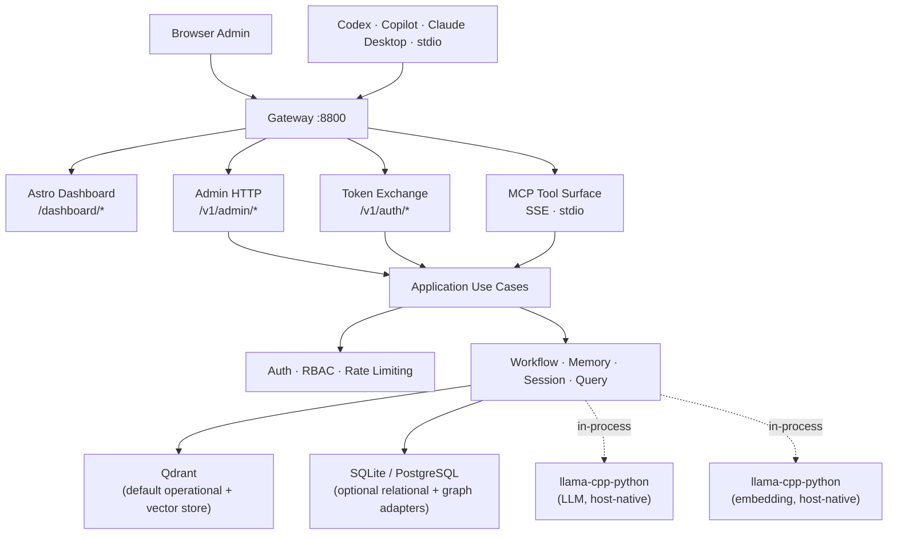

# Minder Server

Minder is a self-hosted MCP platform for repository-aware engineering intelligence. It provides semantic retrieval, workflow governance, and persistent memory for AI agents.

## Architecture

Minder uses a **split AI inference** architecture:

- **LLM inference**: [llama-cpp-python](https://github.com/abetlen/llama-cpp-python) runs natively on the host for hardware-accelerated text generation (Metal on Mac, CPU elsewhere). GGUF models are auto-downloaded from HuggingFace on first startup.
- **Embedding inference**: llama-cpp-python also handles embeddings in-process via a dedicated GGUF embedding model, with no external container dependencies.



### Why local inference?

| Aspect                | LLM (llama-cpp-python)         | Embedding (llama-cpp-python)   |
| --------------------- | ------------------------------ | ------------------------------ |
| Deployment            | Host-native, in-process        | Host-native, in-process        |
| Hardware acceleration | Metal (Mac), CPU elsewhere     | CPU                            |
| Model format          | GGUF                           | GGUF                           |
| Cold start            | Engine init ~3–10s             | Engine init ~2s                |
| Model management      | Auto-download from HuggingFace | Auto-download from HuggingFace |
| Performance           | No HTTP overhead, direct API   | No HTTP overhead, direct API   |

The zero-dependency in-process architecture ensures low latency and reduces the operational burden of managing external inference containers.

### Runtime Layers

```text
Presentation   -> src/minder/presentation/http/admin   (HTTP routes, DTOs)
                 src/dashboard                         (Astro admin console)
Application    -> src/minder/application/admin         (use cases)
Domain         -> src/minder/models                    (entities, value objects)
Infrastructure -> src/minder/store                     (Qdrant, SQLite, PostgreSQL)
                 src/minder/auth                       (principals, middleware)
                 src/minder/llm                        (llama-cpp-python + OpenAI fallback)
                 src/minder/embedding                  (llama-cpp-python GGUF client)
```

---

## Quick Start

### Requirements

- Docker with the Compose plugin
- `curl`

---

### 1) Automatic Installation (Recommended)

```bash
curl -fsSL https://raw.githubusercontent.com/hiimtrung/minder/main/scripts/release/install-minder-release.sh | bash
```

### 2) Manual Installation

#### 1) Start infra and Minder

```bash
docker compose -f docker/docker-compose.yml up -d
```

GGUF models (`ggml-org/gemma-4-E2B-it-GGUF` and `ggml-org/embeddinggemma-300M-GGUF`) are downloaded automatically by llama-cpp-python from HuggingFace on first startup. No manual download required.

#### 3) Bootstrap admin

Open [http://localhost:8800/dashboard/setup](http://localhost:8800/dashboard/setup).

---

### 3) Server Management

#### Update

```bash
# Auto-detect latest version and update:
curl -fsSL https://raw.githubusercontent.com/hiimtrung/minder/main/scripts/release/update-minder.sh | bash

# Update to a specific version:
curl -fsSL https://raw.githubusercontent.com/hiimtrung/minder/main/scripts/release/update-minder.sh | bash -s -- --tag v0.3.0
```

#### Uninstall

```bash
# Keep data volumes (re-run install to refresh):
curl -fsSL https://raw.githubusercontent.com/hiimtrung/minder/main/scripts/release/uninstall-minder.sh | bash -s -- --keep-data

# Full removal of all Minder components:
curl -fsSL https://raw.githubusercontent.com/hiimtrung/minder/main/scripts/release/uninstall-minder.sh | bash
```

---

## Configuration

| Variable                                 | Default                             | Purpose                                                            |
| ---------------------------------------- | ----------------------------------- | ------------------------------------------------------------------ |
| `MINDER_SERVER__PORT`                    | `8800`                              | HTTP listen port                                                   |
| `MINDER_LLM__PROVIDER`                   | `llama_cpp`                         | LLM provider (`llama_cpp` / `openai`)                              |
| `MINDER_LLM__LLAMA_CPP_MODEL_REPO`       | `ggml-org/gemma-4-E2B-it-GGUF`      | HuggingFace repo for LLM GGUF model                                |
| `MINDER_LLM__LLAMA_CPP_MODEL_FILE`       | `*.gguf`                            | GGUF filename pattern                                              |
| `MINDER_LLM__CONTEXT_LENGTH`             | `32768`                             | LLM context window size                                            |
| `MINDER_LLM__TEMPERATURE`                | `0.1`                               | Sampling temperature                                               |
| `MINDER_LLM__OPENAI_API_KEY`             | _(empty)_                           | OpenAI API key for cloud fallback                                  |
| `MINDER_EMBEDDING__PROVIDER`             | `llama_cpp`                         | Embedding provider (`llama_cpp` / `openai`)                        |
| `MINDER_EMBEDDING__LLAMA_CPP_MODEL_REPO` | `ggml-org/embeddinggemma-300M-GGUF` | HuggingFace repo for embedding GGUF model                          |
| `MINDER_EMBEDDING__LLAMA_CPP_MODEL_FILE` | `*.gguf`                            | GGUF filename pattern                                              |
| `MINDER_EMBEDDING__DIMENSIONS`           | `768`                               | Embedding vector dimensions                                        |
| `MINDER_RELATIONAL_STORE__PROVIDER`      | `qdrant`                            | Operational store provider (`qdrant` / `sqlite` / `postgresql`)    |
| `MINDER_VECTOR_STORE__PROVIDER`          | `qdrant`                            | Vector store provider (`qdrant` / in-process fallback)             |
| `MINDER_GRAPH_STORE__PROVIDER`           | `auto`                              | Graph store provider (`auto` / `qdrant` / `sqlite` / `postgresql`) |
| `MINDER_QDRANT__URL`                     | `http://localhost:6333`             | Qdrant endpoint                                                    |

---

## Server Management Scripts

| Script                       | Description                                                   |
| ---------------------------- | ------------------------------------------------------------- |
| `install-minder-release.sh`  | Start Minder stack (GGUF models auto-downloaded on first run) |
| `install-minder-release.ps1` | Windows PowerShell equivalent                                 |
| `update-minder.sh`           | Update to latest or specific version                          |
| `uninstall-minder.sh`        | Uninstall with `--keep-data` option                           |

---

## Documentation

- [Development Workflow](guides/development.md)
- [Local Setup Guide](guides/local-setup.md)
- [Admin & Client Onboarding](guides/admin-client-onboarding.md)
- [Production Deployment](guides/production-deployment.md)
- [System Design](system-design.md)
