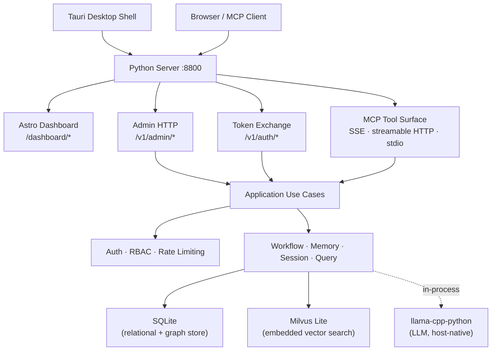
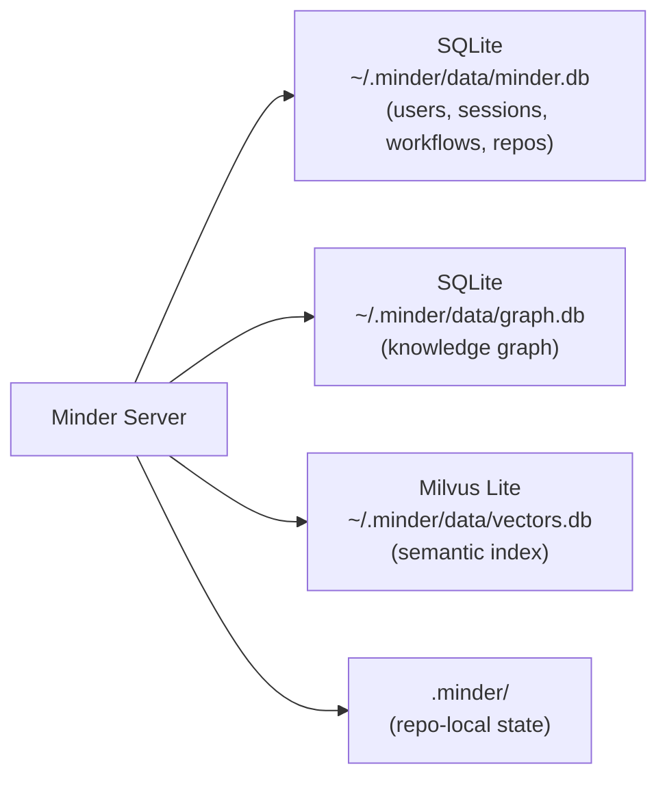

# Minder Server

Minder is a self-hosted MCP platform for repository-aware engineering intelligence. It provides semantic retrieval, workflow governance, and persistent memory for AI agents.

## Architecture

Minder runs **natively** on macOS and Linux — no Docker, no external services.


```mermaid
flowchart TB
    Desktop["Tauri Desktop Shell"] --> Server["Python Server :8800"]
    Browser["Browser / MCP Client"] --> Server

    Server --> Dashboard["Astro Dashboard\n/dashboard/*"]
    Server --> AdminAPI["Admin HTTP\n/v1/admin/*"]
    Server --> AuthAPI["Token Exchange\n/v1/auth/*"]
    Server --> MCPTools["MCP Tool Surface\nSSE · streamable HTTP · stdio"]

    AdminAPI & AuthAPI & MCPTools --> UseCases["Application Use Cases"]
    UseCases --> Auth["Auth · RBAC · Rate Limiting"]
    UseCases --> Services["Workflow · Memory · Session · Query"]

    Services --> SQLite["SQLite\n(relational + graph store)"]
    Services --> Milvus["Milvus Lite\n(embedded vector search)"]
    Services -.->|"in-process"| LlamaCpp["llama-cpp-python\n(LLM, host-native)"]
```

### Technology Stack

| Component          | Technology                                  | Reason                                          |
| ------------------ | ------------------------------------------- | ----------------------------------------------- |
| Language           | Python 3.14+                                | Native fit for LangGraph and ML tooling         |
| MCP SDK            | Official Python `mcp` SDK                   | MCP protocol support                            |
| Orchestrator       | LangGraph                                   | Graph-based agentic workflow engine             |
| Vector DB          | Milvus Lite (`pymilvus>=2.5.0`)             | Embedded file-based vector search, no server    |
| Relational DB      | SQLite + aiosqlite + SQLAlchemy             | Zero-dependency, file-based, async-native       |
| LLM                | llama-cpp-python (GGUF via HuggingFace)     | Hardware-accelerated, Metal/CPU, auto-downloaded |
| Auth               | PyJWT, bcrypt, API keys                     | Team auth and role control                      |
| Package manager    | uv                                          | Fast and reliable dependency management         |
| Dashboard frontend | Astro with Tailwind CSS                     | Static files served by FastAPI                  |
| Desktop shell      | Tauri v2 (optional)                         | Native window, manages Python server as sidecar |

### Runtime Layers

```text
Presentation   -> src/minder/presentation/http/admin   (HTTP routes, DTOs)
                 src/dashboard                         (Astro admin console, served as static files)
Application    -> src/minder/application/admin         (use cases)
Domain         -> src/minder/models                    (entities, value objects)
Infrastructure -> src/minder/store/relational.py       (SQLite / PostgreSQL via SQLAlchemy)
                 src/minder/store/milvus/              (Milvus Lite vector store)
                 src/minder/graph/                     (knowledge graph — SQLite or PostgreSQL)
                 src/minder/auth                       (principals, middleware)
                 src/minder/llm                        (llama-cpp-python + OpenAI fallback)
```

---

## Quick Start

See [Local Development Guide](../guides/local-setup.md) for full setup instructions.

```bash
make native-install   # install deps + build dashboard
make native-run       # start server on :8800
```

Open [http://localhost:8800/dashboard](http://localhost:8800/dashboard).

---

## Configuration

All settings in `minder.toml` or environment variables (`MINDER_<SECTION>__<KEY>`):

| Variable                           | Default                        | Purpose                                         |
| ---------------------------------- | ------------------------------ | ----------------------------------------------- |
| `MINDER_SERVER__PORT`              | `8800`                         | HTTP listen port                                |
| `MINDER_LLM__PROVIDER`             | `llama_cpp`                    | LLM provider (`llama_cpp` / `openai`)           |
| `MINDER_LLM__LLAMA_CPP_MODEL_REPO` | `ggml-org/gemma-4-E2B-it-GGUF` | HuggingFace repo for LLM GGUF model             |
| `MINDER_LLM__LLAMA_CPP_MODEL_FILE` | `gemma-4-E2B-it-Q8_0.gguf`    | GGUF filename                                   |
| `MINDER_RELATIONAL_STORE__PROVIDER`| `sqlite`                       | Relational store (`sqlite` / `postgresql`)      |
| `MINDER_VECTOR_STORE__PROVIDER`    | `milvus`                       | Vector store provider (`milvus` / `memory`)     |
| `MINDER_MILVUS__DB_PATH`           | `~/.minder/data/vectors.db`    | Milvus Lite file path                           |

---

## Storage Topology


```mermaid
flowchart LR
    App["Minder Server"] --> SQLiteRel["SQLite\n~/.minder/data/minder.db\n(users, sessions, workflows, repos)"]
    App --> SQLiteGraph["SQLite\n~/.minder/data/graph.db\n(knowledge graph)"]
    App --> MilvusLite["Milvus Lite\n~/.minder/data/vectors.db\n(semantic index)"]
    App --> RepoState[".minder/\n(repo-local state)"]
```

All data lives in `~/.minder/data/` (created automatically). No external database processes required.

---

## Desktop Distribution (Tauri)

The Tauri shell (`src-tauri/`) wraps the Python server as a sidecar binary:

1. Tauri app launches, shows `src-tauri/splash/index.html`
2. Rust code spawns `binaries/minder-server` (PyInstaller binary in production, shell stub in dev)
3. TCP polling on `:8800` until the server is ready (120s timeout)
4. `WebviewWindow` navigates to `http://localhost:8800/dashboard`

Build the distributable:

```bash
make bundle      # PyInstaller → dist/minder-server/
make app-build   # Tauri → .dmg (macOS) or .deb/.AppImage (Linux)
```

---

## Documentation

- [Local Dev Setup](../guides/local-setup.md)
- [Production Deployment](../guides/production-deployment.md)
- [Native App Migration](../roadmap/native-app-migration.md)
- [System Design](system-design.md)
