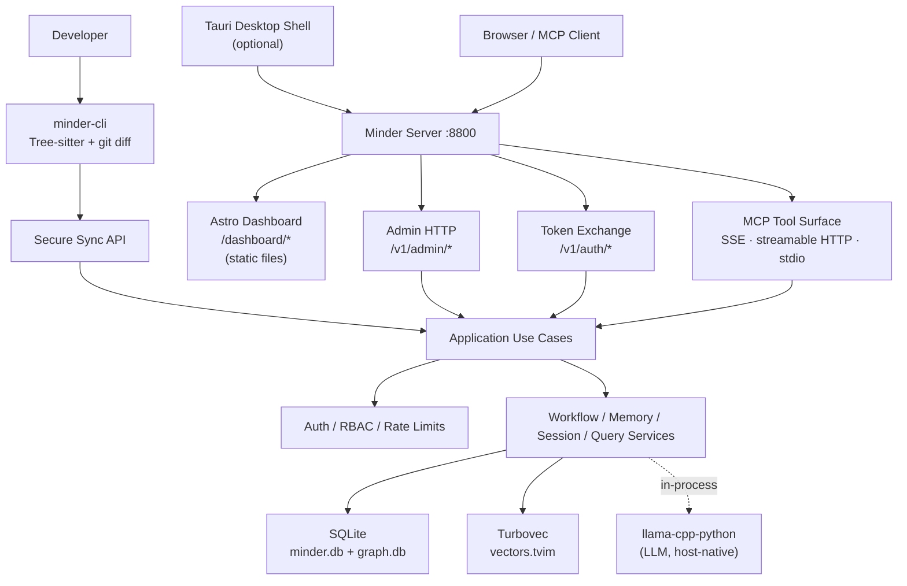
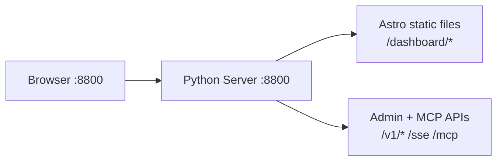
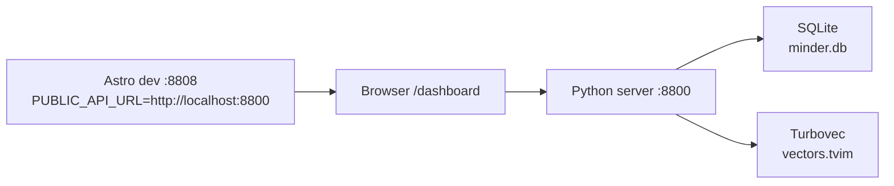
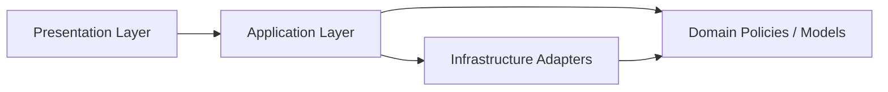
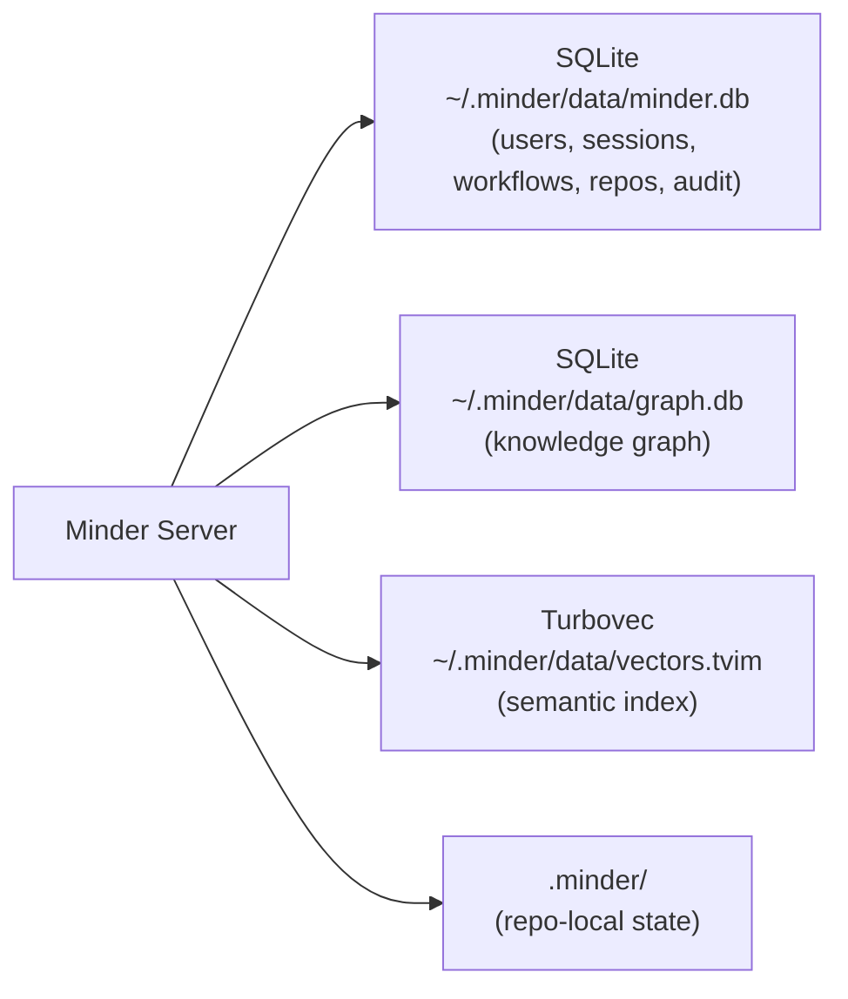
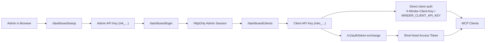
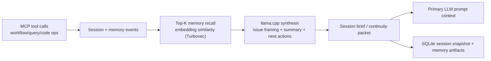
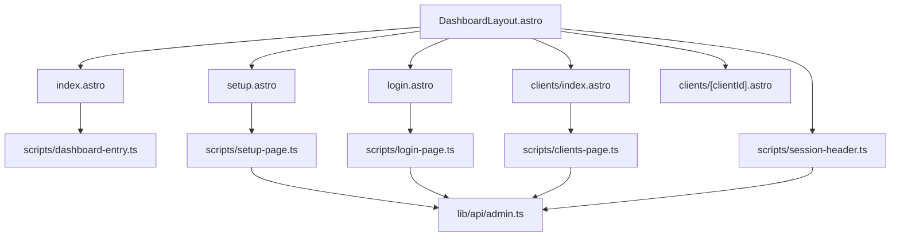

# System Design

This document is the canonical system-design reference for Minder.

Use it for:

- overall architecture
- runtime and deployment shape
- clean architecture boundaries
- storage and retrieval topology
- dashboard and MCP integration flow
- links to deeper feature-specific design documents

## 1. System Overview

Minder is an MCP-first engineering assistant platform that runs **natively** on macOS and Linux — no Docker, no external services required.

Components:

- a PyPI-distributed `minder-cli` edge extractor for fast metadata sync
- an Astro admin console (static files served by FastAPI)
- a provider-aware skill catalog with Dashboard-driven curation
- an MCP gateway over `SSE`, streamable HTTP, and `stdio`
- admin APIs for onboarding and client management
- repository-aware retrieval, workflow, memory, and session tools
- operational data in SQLite (default) or PostgreSQL
- vector search via Turbovec (embedded, 4-bit quantized ANN, file-based)
- LLM inference via llama-cpp-python (Gemma 4 GGUF, auto-downloaded from HuggingFace)
- optional Tauri desktop shell for native distribution

## 2. Technology Stack

| Component          | Technology                                     | Reason                                             |
| ------------------ | ---------------------------------------------- | -------------------------------------------------- |
| Language           | Python 3.14+                                   | Native fit for LangGraph and ML tooling            |
| MCP SDK            | Official Python `mcp` SDK                      | MCP protocol support                              |
| Orchestrator       | LangGraph                                      | Graph-based agentic workflow engine                |
| Vector DB          | Turbovec (`turbovec`)                          | Embedded 4-bit quantized ANN, file-based, no server |
| Relational DB      | SQLite + aiosqlite + SQLAlchemy                | Zero-dependency, async-native                      |
| LLM                | llama-cpp-python (GGUF via HuggingFace)        | Hardware-accelerated (Metal/CPU), auto-downloaded  |
| Auth               | PyJWT, bcrypt, API keys                        | Team auth and role control                         |
| Package manager    | uv                                             | Fast and reliable dependency management            |
| Dashboard frontend | Astro with Tailwind CSS                        | Static files served by FastAPI                     |
| Desktop shell      | Tauri v2 (optional)                            | Native window, manages Python server as sidecar    |

## 3. Runtime Architecture



### AI Inference Architecture

| Concern | Backend | Runtime | Why |
|---------|---------|---------|-----|
| **LLM (text generation)** | llama-cpp-python | Host-native, in-process Python | Hardware-accelerated (Metal/CPU), GGUF format, auto-downloaded from HuggingFace |
| **Embedding** | llama-cpp-python | In-process | No HTTP overhead, same runtime as LLM |

Both backends are lazily initialized on first use. GGUF models auto-download to `~/.minder/models/` on first startup.

## 4. Dashboard Runtime Modes

### Integrated Mode (Default)

FastAPI serves the Astro static build directly. No separate server process required.



### Frontend Dev Mode

For hot-reloaded frontend work, run Astro on its own dev server:



Start with `bun run dev` from `src/dashboard/`.

## 5. Clean Architecture Boundaries



### Presentation

- `src/minder/presentation/http/admin/routes.py` — route composition
- `src/minder/presentation/http/admin/api.py` — JSON admin APIs
- `src/minder/presentation/http/admin/dashboard.py` — static file serving
- `src/minder/presentation/http/admin/context.py` — shared request/auth context

### Application

- `src/minder/application/admin/use_cases.py`
- `src/minder/application/admin/dto.py`

### LangGraph Agent Nodes

Minder uses a graph-based agentic engine (LangGraph) with the following nodes:

- **Workflow Planner**: Determines the current workflow phase and next valid step
- **Planning**: Classifies intent (gen, debug, search) and selects retrieval strategy
- **Retriever**: Generates embeddings and searches Turbovec (semantic) and graph (structural)
- **Reranker**: Cross-encoder reranking and MMR diversity filtering
- **Reasoning**: Builds final prompt with context and enforces workflow step constraints
- **LLM**: Routes generation to local llama-cpp-python with optional OpenAI fallback
- **Guard**: Content safety, hallucination, syntax, and PII checks
- **Verification**: Executes code in subprocess and reports results
- **Evaluator**: Scores output quality and triggers memory/workflow learning loops

### Infrastructure

- `src/minder/store/relational.py` — SQLite / PostgreSQL via SQLAlchemy async
- `src/minder/store/turbovec/` — Turbovec vector store
- `src/minder/graph/` — knowledge graph store (SQLite or PostgreSQL)
- `src/minder/auth/` — principals, middleware
- `src/minder/transport/` — MCP transport (SSE, streamable HTTP, stdio)

## 6. Storage Topology



All data lives in `~/.minder/data/`. No external database processes required.

### SQLite (Relational Store)

Primary operational store for:
- users, clients, API key metadata
- sessions, memories, skills
- workflow definitions and state
- audit events and repository registrations

### Turbovec (Vector Store)

Used for:
- document embeddings
- semantic retrieval
- vector-backed code/document search

Turbovec runs embedded in-process using `turbovec.IdMapIndex` (4-bit quantized ANN). The index is stored at `~/.minder/data/vectors.tvim` with a companion `.tvim.meta` JSON mapping. All blocking index operations are wrapped with `asyncio.to_thread()` to avoid blocking the FastAPI event loop.

### Knowledge Graph Store

Used for:
- repository structure and dependency topology
- metadata for files, functions, controllers, routes, and message-queue flow
- durable graph edges: `imports`, `calls`, `depends_on`, `publishes`, `consumes`

Policy:
- graph storage is metadata-first
- full source code is not stored in `GraphNode` payloads by default
- optional code excerpts for durable, reusable snippets only

### Edge Extraction Direction

Structural extraction runs close to the repository:
- `minder-cli` uses Tree-sitter parsers to extract metadata from changed files
- `git diff` drives delta-based refresh
- the CLI pushes structural JSON to the server through a secure sync API
- the server is the source of truth for graph persistence, semantic indexing, orchestration, and dashboard delivery

## 7. Admin and Client Auth Flow



## 8. Context Continuity Layer (Memory + Session Intelligence)

Minder treats memory/session as a context continuity subsystem, not only a CRUD surface.

Primary objective:
- keep long-running engineering flows coherent across many tool calls
- reduce primary LLM context-window drift on large tasks
- summarize and compact high-signal context for later reuse

### Layered Design



### Session Boot — Single Entry Point

`minder_session_boot` is the unified entry point for all session flows. It handles create, find, and restore transparently:

- Pass `project_name` (stable slug) → finds or creates
- Pass `project_name` + `session_id` (UUID) → restores a specific session directly
- Returns `session_found`, `session_summary`, and `_next_steps` hints for immediate orientation

`minder_session_save` handles both state checkpointing and context updates (branch, open files) in one call, eliminating the need for a separate context update tool.

### Workflow Instruction Compiler (Strict Mode)

When a repository has an active workflow, Minder compiles and enforces a deterministic instruction envelope before any primary LLM generation:

- `workflow_id`, `workflow_version`
- `current_step`, `next_step`, `blocked_by`
- `required_artifacts` and completion criteria
- `forbidden_actions`
- `allowed_tools` for current step
- `output_contract` expected from the primary LLM

`minder_workflow_step(include_definition=true)` returns the full definition in one call. Subsequent calls without the flag are lightweight current-step checks.

## 9. Skill Registry and Graph Metadata Policy

- The Dashboard exposes skill list, create, update, and delete flows
- Skill retrieval is workflow-step aware with step-compatibility scoring
- `minder_skill_store` acts as upsert: pass `skill_id` to update, `deprecated=True` to retire without deleting
- `minder_memory_store` acts as upsert: pass `memory_id` to update an existing entry
- Memory stores **project-specific facts**; skills store **cross-project reusable patterns**

Graph intelligence follows a metadata-first contract:
- `GraphNode` persists structural metadata only (not full source bodies)
- Repository scanning extracts signatures, paths, route patterns, topic names, dependency relationships
- Bounded reusable excerpts only when a code fragment is worth keeping

## 10. Frontend Structure



Key paths:
- `src/dashboard/src/layouts/DashboardLayout.astro`
- `src/dashboard/src/pages/setup.astro`
- `src/dashboard/src/pages/login.astro`
- `src/dashboard/src/pages/index.astro`
- `src/dashboard/src/pages/clients/index.astro`
- `src/dashboard/src/scripts/dashboard-entry.ts`
- `src/dashboard/src/lib/api/admin.ts`

## 11. Deployment Shape

### Local Dev

```bash
make native-install   # install deps + build dashboard
make native-run       # start server on :8800
```

All state in `~/.minder/data/`. Models auto-download to `~/.minder/models/`.

### Desktop App (Tauri)

```bash
make bundle      # PyInstaller → dist/minder-server/
make app-build   # Tauri → .dmg (macOS) or .deb/.AppImage (Linux)
```

Tauri sidecar flow:
1. App starts → shows splash screen (`src-tauri/splash/index.html`)
2. Rust code spawns `binaries/minder-server` (PyInstaller binary)
3. TCP polling on `:8800` until server is ready
4. `WebviewWindow` navigates to `http://localhost:8800/dashboard`

### Headless Server (Linux)

```bash
uv run python -m minder.server
```

Serve behind nginx or Caddy for TLS termination. See [Production Deployment](../guides/production-deployment.md).

## 12. Related Design Documents

- [Minder Server Architecture](minder-server.md)
- [MCP Tool Reference](../roadmap/03-data-model-and-tools.md)
- [Local Dev Setup](../guides/local-setup.md)
- [Production Deployment](../guides/production-deployment.md)
- [Native App Migration](../roadmap/native-app-migration.md)
