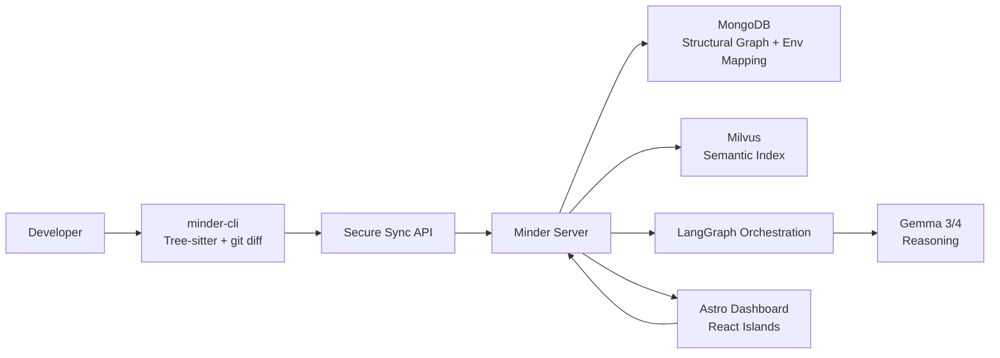

# Design: CLI Edge Extractor and Graph Sync Architecture

Canonical system reference:

- [System Design](../../docs/system-design.md)

**Date**: 2026-04-15
**Status**: Proposed
**Author**: Architect

---

## Architecture Overview

This design introduces a new execution shape to replace the slow `GraphNode` refresh path with an edge-native extraction model. Instead of asking the server to infer repository structure from broad source ingestion, a standalone `minder-cli` runs close to the repository, parses only changed files, and pushes compact structural metadata to the server.

The system is organized into three pillars:

- `minder-cli`: a PyPI-distributed metadata extractor using Tree-sitter and git-aware delta processing
- Minder Server: the central graph, semantic search, and orchestration engine
- Minder Dashboard: an Astro shell with interactive graph and environment-management surfaces

This change preserves the metadata-first graph policy while improving ingestion latency and reducing server-side model cost. It also separates structural extraction from semantic reasoning: embeddings stay in a dedicated embedding layer, while Gemma 3/4 remains the reasoning model used through LangGraph.

---

## Three-Pillar Model

---

## Phase Roadmap

### Phase 1: The Edge Node (`minder-cli`)

Goal: create a standalone, non-intrusive extraction tool.

Core decisions:

- implemented in Python and distributed via PyPI
- uses Tree-sitter for language-agnostic AST parsing across Python, Java, and TS/JS
- uses `git diff` and repo/branch detection to process only changed files by default
- extracts metadata, not full source payloads

Primary extracted entities:

- functions
- classes
- interfaces
- abstract methods
- TODO comments
- optionally routes, controller handlers, queue topics, and producer/consumer metadata

Nominal flow:

1. Developer runs `minder sync`.
2. CLI identifies repo, branch, and diff base.
3. CLI parses changed files and generates structural JSON.
4. CLI pushes signed payloads to the Minder Server sync API.

### Phase 2: Core Infrastructure and AI

Goal: build the central server-side brain.

Dual-storage strategy:

- MongoDB stores structural graph data and environment mappings such as `main -> production`
- Milvus stores semantic embeddings for code snippets, docs, and high-value excerpts

AI pipeline:

- LangGraph orchestrates ingestion follow-up, retrieval, impact analysis, and reasoning flows
- Gemma 3/4 reasons over graph context, semantic hits, and workflow state
- a dedicated embedding model produces vectors for Milvus; Gemma 3/4 is not the embedding engine

### Phase 3: Minder MCP Server

Goal: expose the graph and semantic layers to agents and the Dashboard.

Protocol and resources:

- MCP over SSE
- `minder://{repo}/{env}/structure`
- `minder://{repo}/{branch}/todos`

Tools:

- `find_impact(entity)` for downstream effect tracing
- `semantic_search(query)` for intent-based architectural search

### Phase 4: Astro Dashboard

Goal: provide a visual command center.

Frontend direction:

- Astro for shell and route composition
- React islands for graph-heavy interactivity
- React Flow or Cytoscape.js for graph exploration
- dedicated UI for mapping branches to environments such as Dev, Staging, and Prod
- SSE-first live updates; WebSockets remain optional, not required in the base architecture

### Phase 5: Professional CI/CD and Distribution

Goal: automate lifecycle management for the CLI, server, models, and dashboard.

CLI release path:

- trigger on git tag such as `v1.2.0`
- GitHub Actions builds `.whl` and source distributions
- publish to PyPI via Trusted Publishing/OIDC
- CLI can check PyPI during `minder sync` and suggest upgrade

Deployment summary:

| Component       | Hosting Strategy                                    |
| --------------- | --------------------------------------------------- |
| `minder-cli`    | PyPI package installed on developer machines        |
| Minder Server   | Docker Compose locally or private cloud deployment  |
| Gemma 3/4 runtime | Local GPU or containerized inference runtime        |
| Dashboard       | Docker or managed static/app hosting with CI deploy |

---

## Review Notes

### Accepted Direction

- moving extraction to a repo-local CLI is the right fix for slow graph refreshes
- delta-based sync is a better scaling model than server-side broad source analysis
- structural graph and semantic retrieval should remain separate storage concerns
- Astro plus React islands is a good fit for a mostly static admin shell with selective heavy interactivity

### Adjustments Applied

- Gemma 3/4 is documented as the reasoning model, not the primary embedding model
- SSE is kept as the baseline real-time channel because it aligns with the current transport posture and is simpler than mandatory WebSockets
- sub-second sync is treated as a target for small or medium diffs, not an unconditional guarantee across all repositories

### Risks

- Tree-sitter coverage and parser packaging need a disciplined plugin/versioning strategy
- secure repo-to-server sync requires auth, replay protection, payload versioning, and tenancy scoping
- branch-to-environment mapping can drift unless the dashboard and sync API define one source of truth
