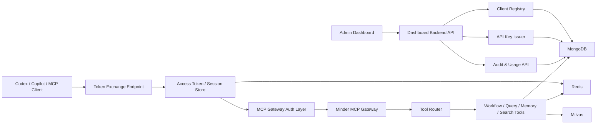
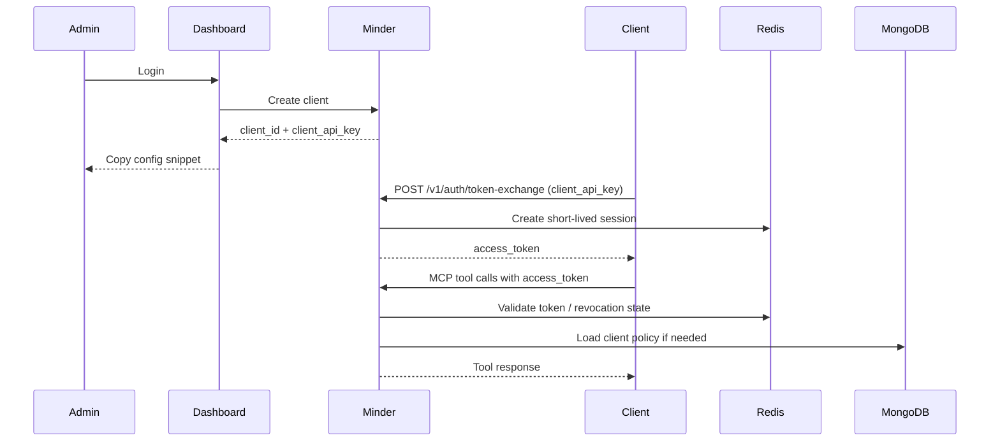

# MCP Gateway Auth Dashboard Design

Canonical system reference:

- [System Design](../../docs/system-design.md)

> **Document version**: 1.0
> **Date**: 2026-04-08
> **Status**: Draft for review
> **Scope**: Phase 4.0 design input

---

## 1. Purpose

Minder currently exposes an MCP server with authenticated tools, but the client onboarding flow is still too technical for real-world use with tools like Codex, VS Code Copilot-style MCP clients, Claude Desktop, and internal LLM agents.

Today the flow is:

1. bootstrap an admin user
2. manually obtain an API key
3. call `minder_auth_login`
4. extract a JWT
5. attach `Authorization: Bearer ...` on every protected tool call

This works technically, but it is not a good product experience. The goal of this design is to evolve Minder into an **MCP gateway product** with:

- an admin dashboard
- first-class client registration
- client API keys
- short-lived access token exchange
- auditability and revocation
- low-friction onboarding for MCP-capable IDEs and agent runtimes

The target outcome is that an administrator can create a client in a dashboard, copy a configuration snippet, and have Codex/Copilot/other MCP clients connect without manual JWT handling.

---

## 2. Goals

### Primary goals

- Make Minder easy to connect to from external MCP clients.
- Replace manual JWT handling with a simple API-key-based client bootstrap flow.
- Add an admin dashboard for client management and onboarding.
- Separate human admin identity from machine client identity.
- Preserve current MCP tool contracts while improving authentication and onboarding.

### Secondary goals

- Support per-client scoping, quotas, and revocation.
- Centralize audit trails for all client-issued MCP calls.
- Use Redis for short-lived token/session state and MongoDB for durable configuration and audit metadata.
- Keep the transport layer compatible with both `SSE` and `stdio`.

### Non-goals

- Replacing the current MCP tool set.
- Replacing repo-local workflow/state behavior.
- Designing Phase 5 learning features.
- Full SSO integration in the first wave.
- Vendor-specific direct Copilot plugin integration. This design focuses on standards-based MCP and gateway behavior.

---

## 3. Problems in the Current UX

### Current pain points

- Manual `initialize -> login -> token extraction -> bearer reuse` is too complex.
- Clients that do not support easy per-request auth header injection are awkward to use.
- Admin bootstrap is script-driven, not dashboard-driven.
- The current auth model is user-centric, not client-centric.
- Long-lived API key and short-lived runtime token concerns are not clearly separated.
- There is no first-class place to manage:
  - clients
  - scopes
  - revocation
  - onboarding instructions
  - audit logs

### Product consequence

The current model is fine for integration tests and power users, but not for broad adoption by:

- IDE-integrated agents
- internal automation services
- multi-user development teams
- hosted or semi-hosted MCP client environments

---

## 4. Target Product Experience

### Admin experience

1. Admin signs into the Minder dashboard.
2. Admin creates a new client such as `codex-local`, `copilot-team-a`, or `claude-desktop-alice`.
3. Admin assigns scopes:
   - allowed tools
   - repo scope
   - workflow scope
   - rate/usage policy
4. Dashboard generates a `client_api_key`.
5. Dashboard shows:
   - server URL
   - auth mode
   - copy-paste config snippet
   - connection test button

### Client experience

1. Client is configured with:
   - `MCP server URL`
   - `client_api_key`
2. Client performs a token exchange or bootstrap handshake automatically.
3. Minder issues a short-lived `access_token`.
4. Client calls tools normally.
5. Token rotation/refresh is handled automatically by the client integration or SDK helper.

The client should not need to manually call `minder_auth_login`.

---

## 5. High-Level Architecture

This section is feature-specific. For the full platform topology, see:

- [System Design](../../docs/system-design.md)



### Main components

- **Dashboard Frontend**
  - admin UI for clients, scopes, and onboarding
- **Dashboard Backend**
  - admin auth
  - client CRUD
  - API key issuance
  - token/session visibility
  - audit views
- **Token Exchange API**
  - exchanges `client_api_key` for short-lived access tokens
- **MCP Gateway Auth Layer**
  - resolves client identity and tool permissions
  - injects authenticated context into MCP tool calls
- **Redis Session Layer**
  - stores short-lived token/session state
  - fast revocation checks
- **MongoDB Durable Layer**
  - client metadata
  - key metadata
  - policies
  - audit logs

---

## 6. Identity Model

The design separates **human administrators** from **machine clients**.

### Human identities

- `AdminUser`
- authenticates into dashboard
- can create clients and manage policies

### Machine identities

- `Client`
- used by Codex/Copilot/MCP agents
- authenticates using a client API key
- receives short-lived access tokens

### Why this split matters

- Human dashboard access and machine MCP access have different risk profiles.
- Machine credentials should be revocable and scoped independently.
- A single admin may manage many clients.
- Audit logs should clearly distinguish:
  - who created the client
  - which client called which tool

---

## 7. Authentication and Token Flow

## 7.1 Credential types

### Admin session credential

- used for dashboard login
- browser or dashboard API only

### Client API key

- long-lived bootstrap secret
- issued once by the dashboard
- used only to obtain short-lived runtime access

### Client access token

- short-lived token for MCP tool calls
- default lifetime recommendation: `15m` to `60m`
- renewable via token exchange or refresh path

## 7.2 Recommended flow



## 7.3 Why not use only the API key directly on every MCP call

Direct API-key-per-call auth is possible, but not preferred:

- higher exposure if intercepted
- weaker revocation semantics
- harder to add session metadata and rotation
- less room for usage controls and audit enrichment

A token exchange layer gives better security and operability.

## 7.4 Backward compatibility

The current user-oriented flow can remain for:

- bootstrap/admin scripts
- integration tests
- internal dev workflows

But client onboarding should move toward the new flow.

---

## 8. Proposed Auth Modes

The gateway should support two auth modes for MCP clients.

### Mode A: Standard bearer mode

- client exchanges `client_api_key` for `access_token`
- client sends:
  - `Authorization: Bearer <access_token>`

Best for:

- clients that can inject headers reliably
- server-to-server MCP usage

### Mode B: Simple client-key bootstrap mode

- client sends:
  - `X-Minder-Client-Key: <client_api_key>`
- gateway transparently exchanges/resolves identity
- server internally creates short-lived client session context

Best for:

- MCP clients with poor auth ergonomics
- quick-start tooling
- initial Codex/Copilot onboarding

### Recommendation

Implement both, but position Mode B as the easiest onboarding path.

---

## 9. Data Model Additions

The following entities should be added in MongoDB.

### `admin_users`

- existing user model can be extended or re-used
- dashboard-specific auth/session metadata may be added

### `clients`

- `id`
- `name`
- `slug`
- `description`
- `status`
- `created_by_user_id`
- `owner_team`
- `transport_modes`
- `tool_scopes`
- `repo_scopes`
- `workflow_scopes`
- `rate_limit_policy`
- `created_at`
- `updated_at`

### `client_api_keys`

- `id`
- `client_id`
- `key_prefix`
- `secret_hash`
- `status`
- `last_used_at`
- `created_by_user_id`
- `created_at`
- `expires_at`
- `revoked_at`

Only the hash should be stored. The raw key is shown once.

### `client_sessions`

- `id`
- `client_id`
- `access_token_id`
- `issued_at`
- `expires_at`
- `status`
- `last_seen_at`
- `metadata`

### `audit_logs`

- `id`
- `actor_type` (`admin_user`, `client`)
- `actor_id`
- `event_type`
- `resource_type`
- `resource_id`
- `request_id`
- `tool_name`
- `outcome`
- `ip`
- `user_agent`
- `metadata`
- `created_at`

---

## 10. Redis Responsibilities

Redis should become the authoritative fast path for runtime auth/session state.

### Redis use cases

- access token lookup
- revocation cache
- rate limit counters
- short-lived MCP session state
- token exchange throttling

### Data examples

- `minder:client_session:<session_id>`
- `minder:access_token:<token_id>`
- `minder:revoked_token:<token_id>`
- `minder:rate_limit:<client_id>:<window>`

### Why Redis

- fast validation on every tool call
- supports token expiration naturally
- avoids repeated database lookups on hot auth paths

MongoDB remains the durable source of record for metadata and audit trails.

---

## 11. Dashboard Functional Scope

## 11.1 Admin authentication

- login page
- logout
- session expiry handling
- role check for admin-only screens

## 11.2 Client registry

- list clients
- create client
- edit client metadata
- disable/enable client
- archive/delete client

## 11.3 API key management

- issue new key
- reveal once
- rotate key
- revoke key
- list key metadata

## 11.4 Policy management

- allowed tools
- repo allowlist
- repo denylist
- workflow policy linkage
- rate limit profile
- optional model/runtime constraints

## 11.5 Onboarding UX

- copy config for Codex
- copy config for VS Code/Copilot-style MCP clients
- copy config for Claude Desktop
- test connection button
- health status panel

## 11.6 Audit and observability

- recent tool calls
- failed auth attempts
- revoked client usage
- rate limit violations
- token exchange history

---

## 12. Proposed API Surface

## 12.1 Dashboard admin APIs

### `POST /v1/admin/auth/login`

- dashboard admin login

### `GET /v1/admin/clients`

- list clients

### `POST /v1/admin/clients`

- create client

### `GET /v1/admin/clients/:id`

- client details

### `PATCH /v1/admin/clients/:id`

- update client metadata and scopes

### `POST /v1/admin/clients/:id/keys`

- create a new client API key

### `POST /v1/admin/keys/:id/revoke`

- revoke existing client API key

### `GET /v1/admin/audit`

- audit log query

## 12.2 Client auth APIs

### `POST /v1/auth/token-exchange`

Request:

```json
{
  "client_api_key": "mkc_xxx",
  "client_name": "codex-local",
  "requested_scopes": ["minder_query", "minder_search_code"]
}
```

Response:

```json
{
  "access_token": "<token>",
  "expires_in": 3600,
  "token_type": "Bearer",
  "client_id": "..."
}
```

### `POST /v1/auth/refresh`

- optional in first iteration
- can be deferred if token exchange is cheap enough

### `POST /v1/auth/revoke`

- revoke current access token/session

## 12.3 Gateway introspection APIs

### `GET /v1/gateway/health`

- returns readiness of MongoDB, Redis, Milvus, and MCP transport

### `POST /v1/gateway/test-connection`

- validates client bootstrap credential and effective scopes

---

## 13. MCP Gateway Changes

The MCP transport/auth layer should evolve from a user-only auth assumption to a principal-based model.

### Current model

- request is authenticated as a `User`
- user is injected into tool handler

### Target model

- request is authenticated as a `Principal`
- principal can be:
  - `AdminUserPrincipal`
  - `ClientPrincipal`

### Implication

Tool handlers should not assume all authenticated callers are human users.

Recommended abstraction:

```text
Principal
  - principal_type
  - principal_id
  - role
  - scopes
  - repo_scope
  - metadata
```

The transport middleware validates the presented credential and resolves a principal before invoking the tool.

---

## 14. Security Requirements

### API keys

- store only hashes
- show raw value once
- support revoke and rotate
- support per-key last-used timestamp

### Access tokens

- short-lived
- signed
- revocation-aware
- bound to client identity and scopes

### Scope enforcement

- deny by default
- tool allowlist per client
- optional repo constraints
- future support for workflow constraints

### Auditability

- every token exchange logged
- every tool call attributed
- every auth failure logged

### Abuse protection

- rate limit token exchange
- rate limit tool calls
- optional IP restrictions later

---

## 15. Migration Strategy

The rollout should avoid breaking current users or tests.

### Stage 1

- keep current user-based auth flow
- add new client entities and token exchange
- do not remove `minder_auth_login`

### Stage 2

- add gateway-aware auth middleware
- support both user-JWT and client-token principals

### Stage 3

- add dashboard backend + frontend
- start using dashboard-generated client keys for real clients

### Stage 4

- mark manual login flow as legacy for external MCP clients
- retain it only for bootstrap and low-level debugging

---

## 16. Risks

### Product risks

- Too many auth modes may confuse operators.
- If onboarding snippets differ too much by client, support burden rises.

### Technical risks

- Some MCP clients may not support custom headers well.
- SSE transport may still require client-specific auth workarounds.
- Tool handlers may need refactoring to use principal scope instead of assuming user identity.

### Operational risks

- Revocation logic can become inconsistent if Redis and MongoDB drift.
- Weak audit coverage would make incidents hard to investigate.

---

## 17. Decisions

### Decision 1

Minder should become a **client-aware MCP gateway**, not just a raw authenticated MCP server.

### Decision 2

Human admin authentication and machine client authentication must be modeled separately.

### Decision 3

Client onboarding should center on:

- dashboard-created client
- API key bootstrap
- short-lived access token

not on manual `minder_auth_login` calls.

### Decision 4

Redis should be used for short-lived access/session state and rate limiting, while MongoDB remains the durable source of truth.

### Decision 5

The current MCP tool surface should remain stable; onboarding and auth should improve without forcing broad tool contract churn.

---

## 18. Proposed Implementation Waves

### Wave 1 — Client Identity and Token Exchange

- add client domain model
- add client API key issuance and hashing
- add token exchange endpoint
- add Redis-backed client session state

### Wave 2 — Gateway Principal Model

- introduce `Principal` abstraction
- update transport auth flow for client principals
- add scope checks and per-tool enforcement

### Wave 3 — Dashboard Backend

- admin auth endpoints
- client CRUD
- API key management
- audit endpoints
- connection test endpoint

### Wave 4 — Dashboard Frontend

- admin login
- client registry
- API key create/revoke/rotate
- onboarding instructions
- audit views

### Wave 5 — Verification and Hardening

- end-to-end client onboarding tests
- rate limiting
- observability
- production auth review

---

## 19. Acceptance Criteria

The design is considered successfully implemented when:

1. Admin can sign into the dashboard.
2. Admin can create a client and generate an API key.
3. Client can exchange API key for an access token.
4. MCP client can call protected tools without manual JWT login flow.
5. Tool access is limited by configured scopes.
6. API keys can be revoked and rotated.
7. Every tool call is visible in audit logs.
8. Codex/Copilot-style onboarding can be completed from dashboard instructions alone.

---

## 20. Open Questions

1. Should dashboard admin auth initially re-use the existing Minder user/JWT system, or should it have a dedicated auth boundary from day one?
2. Should client access tokens be opaque Redis-backed tokens or signed JWTs with Redis revocation checks?
3. Should `stdio` clients support the same token exchange path directly, or should they use a local bootstrap config file generated by the dashboard?
4. Which external MCP client should be treated as the primary UX target in the first implementation:
   - Codex
   - VS Code Copilot-style client
   - Claude Desktop
5. Should per-client repo scoping be enforced at transport entry or at tool execution layer?

---

## 21. Recommendation

Proceed with this as **Phase 4.0**, ahead of general dashboard and observability work already listed in Phase 4.

Reason:

- It directly removes the current biggest adoption blocker.
- It provides the right identity model for multi-user and multi-client scale.
- It creates a clean foundation for later:
  - quotas
  - dashboard management
  - audit trails
  - enterprise onboarding
