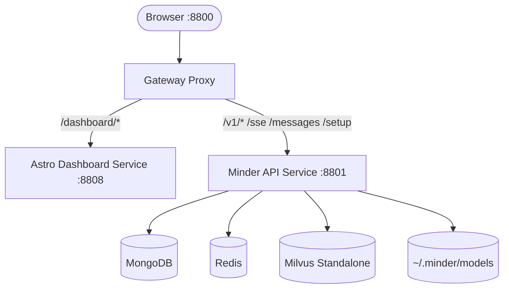
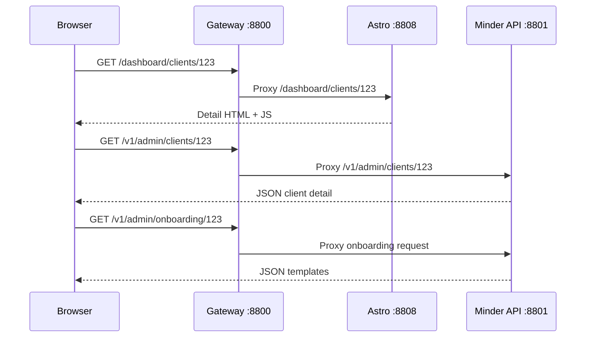

# Design: Production Dashboard Reverse Proxy Split

**Date**: 2026-04-09
**Status**: Proposed
**Requirements**: [System Design](../../docs/system-design.md)
**Author**: GitHub Copilot

---

## Architecture Overview

Production should stop treating the Astro dashboard as a static asset tree served by the Python API process. That shape creates route-ownership conflicts for pages like `/dashboard/clients/[clientId]`, where Astro expects a real application route but the backend can only approximate it with static fallbacks.

The production deployment should instead use a reverse-proxied split runtime: a public gateway on port `8800`, an internal `minder-api` service for `/v1`, `/sse`, `/messages`, and related backend routes, and an internal `dashboard` service running Astro's standalone Node server for all `/dashboard/*` routes. This keeps the browser on one origin while letting Astro own its routing model directly.

---

## Component Diagram



---

## Primary Data Flow



---

## Compose Blueprint

### Public entrypoint

| Service      | Internal Port | Public Port | Responsibility                                 |
| ------------ | ------------- | ----------- | ---------------------------------------------- |
| `gateway`    | `8800`        | `8800`      | Reverse proxy and single browser entrypoint    |
| `dashboard`  | `8808`        | none        | Astro standalone runtime for `/dashboard/*`    |
| `minder-api` | `8801`        | none        | Admin APIs, MCP gateway, SSE, auth, onboarding |

### Routing contract

| Path Pattern                    | Upstream          |
| ------------------------------- | ----------------- |
| `/dashboard` and `/dashboard/*` | `dashboard:8808`  |
| `/v1/*`                         | `minder-api:8801` |
| `/sse` and `/messages/*`        | `minder-api:8801` |
| `/setup`                        | `minder-api:8801` |
| everything else                 | `minder-api:8801` |

---

## API Contract

### Browser-facing routing contract

| Method     | Path                                                  | Served By    | Notes                                                              |
| ---------- | ----------------------------------------------------- | ------------ | ------------------------------------------------------------------ |
| `GET`      | `/dashboard`                                          | `dashboard`  | Astro root shell resolves setup/login/clients state via API        |
| `GET`      | `/dashboard/login`                                    | `dashboard`  | Astro login page                                                   |
| `GET`      | `/dashboard/setup`                                    | `dashboard`  | Astro setup page                                                   |
| `GET`      | `/dashboard/clients`                                  | `dashboard`  | Astro registry page                                                |
| `GET`      | `/dashboard/clients/:clientId`                        | `dashboard`  | Astro detail page                                                  |
| `GET`      | `/v1/admin/bootstrap-state`                           | `minder-api` | Public bootstrap/session state for Astro root/auth-aware redirects |
| `GET/POST` | existing `/v1/admin/*`, `/v1/auth/*`, `/v1/gateway/*` | `minder-api` | No contract change required                                        |

### Bootstrap-state response

```ts
interface DashboardBootstrapStateDto {
  has_admin_users: boolean;
  has_admin_session: boolean;
}
```

---

## Database Schema

No schema changes are required. MongoDB, Redis, and Milvus responsibilities remain unchanged.

---

## Security Considerations

- The browser still sees a single origin on `:8800`; cookies remain same-origin.
- The `dashboard` service is not publicly exposed directly.
- The `minder-api` service is not publicly exposed directly.
- Gateway ownership of routing removes backend static fallback logic for Astro-only routes.

---

## Architecture Decision Records

### ADR-001: Production Uses Reverse-Proxy Split Runtime Instead Of Backend-Served Astro Assets

**Status**: Accepted
**Date**: 2026-04-09

**Context**:
Astro route ownership for dynamic dashboard paths conflicts with backend static serving and fallback logic, especially for `/dashboard/clients/[clientId]`.

**Decision**:
Production will use a dedicated `dashboard` runtime behind a gateway proxy, while the Python backend continues to serve only APIs and MCP transport routes.

**Rationale**:
This preserves one public origin while letting Astro handle its own route graph correctly.

**Consequences**:

- Positive: dashboard routing becomes reliable and predictable.
- Positive: backend no longer needs to understand Astro build internals.
- Negative: production now runs an extra proxy service and an extra frontend runtime.

**Alternatives Considered**:
| Option | Reason Rejected |
|--------|-----------------|
| Continue backend static fallback routing | Too fragile for Astro dynamic routes and future dashboard growth |
| Expose Astro directly on a second public port | Breaks the single-origin browser contract and complicates operator UX |

### ADR-002: Gateway Owns Port 8800

**Status**: Accepted
**Date**: 2026-04-09

**Context**:
The product requirement is to keep browser access on `http://host:8800/dashboard` while splitting dashboard and API runtimes internally.

**Decision**:
A reverse proxy service becomes the only public port binder and forwards `/dashboard/*` to Astro and all API/MCP traffic to the backend.

**Rationale**:
This keeps the operator-facing contract unchanged while isolating responsibilities internally.

**Consequences**:

- Positive: external URLs remain stable.
- Positive: same-origin API requests and cookies still work.
- Negative: proxy configuration becomes part of the production contract.

**Alternatives Considered**:
| Option | Reason Rejected |
|--------|-----------------|
| Publicly expose backend on `8800` and Astro on `8808` | Changes user-facing URLs and creates cross-origin concerns |
| Keep Python as the public router for Astro HTML | Reintroduces the route-ownership problem this design is fixing |
