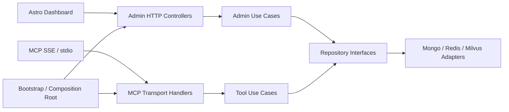
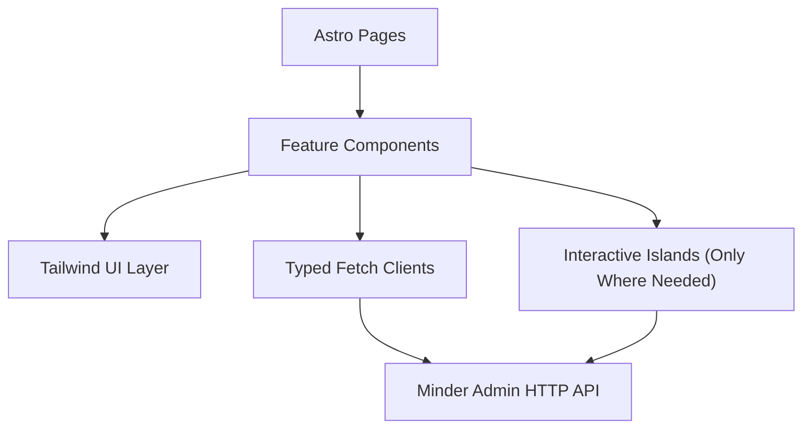

# Design: Phase 4.3 Console Clean Architecture and UI Modernization

Canonical system reference:
- [System Design](/Users/trungtran/ai-agents/minder/docs/system-design.md)

**Date**: 2026-04-09
**Status**: Proposed
**Related requirements**: [`docs/requirements/p4_3_console_clean_architecture_and_ui_modernization.md`](/Users/trungtran/ai-agents/minder/docs/requirements/p4_3_console_clean_architecture_and_ui_modernization.md)

---

## Objective

Refactor [`src/minder/server.py`](/Users/trungtran/ai-agents/minder/src/minder/server.py) from a one-file web console and MCP bootstrap into a clean composition root, while migrating the browser console to a dedicated `Astro` dashboard backed by typed admin APIs and served as static assets from the Python app.

This design keeps the current MCP gateway behavior intact and treats the current browser flows as features to preserve, not code to preserve.

---

## Current-State Diagnosis

[`src/minder/server.py`](/Users/trungtran/ai-agents/minder/src/minder/server.py) currently mixes:

- application bootstrap and runtime startup
- dependency construction for store/cache/vector/transport
- HTTP route registration
- HTML rendering
- browser session and cookie handling
- admin/client-management controllers
- response shaping and operational logging

This violates the project clean architecture rules because presentation, application, and infrastructure concerns all live in one module.

---

## Target Architecture

This section describes the Phase 4.3 refactor slice. For the full runtime and deployment shape, see:
- [System Design](/Users/trungtran/ai-agents/minder/docs/system-design.md)



### Layer Rules

- `presentation`: HTTP/MCP controllers, DTO parsing, response mapping, auth/session extraction
- `application`: use cases and orchestration logic only
- `domain`: entities, value objects, policies, repository contracts
- `infrastructure`: MongoDB, Redis, Milvus, transport/framework glue
- `bootstrap`: object graph wiring and app assembly only

No HTML rendering or business flow orchestration should remain in [`src/minder/server.py`](/Users/trungtran/ai-agents/minder/src/minder/server.py) after the migration.

---

## Proposed Module Split

### Python backend

```text
src/minder/
  bootstrap/
    app.py
    dependencies.py
    runtime.py
  presentation/
    http/
      admin/
        routes.py
        controllers.py
        dto.py
        session.py
      auth/
        routes.py
        controllers.py
        dto.py
    mcp/
      server.py
      registration.py
  application/
    admin/
      use_cases/
        create_client.py
        list_clients.py
        get_client_detail.py
        issue_client_key.py
        revoke_client_keys.py
        test_client_connection.py
        get_client_activity.py
      dto.py
    auth/
      use_cases/
    dashboard/
      policies.py
  infrastructure/
    web/
      starlette_app.py
      cookies.py
```

### Frontend dashboard

```text
src/dashboard/
  src/pages/
    login.astro
    setup.astro
    clients/index.astro
    clients/[clientId].astro
  components/
  features/
    clients/
    auth/
    onboarding/
  lib/
    api/
    schemas/
    session/
```

---

## Backend Refactor Plan

### 1. Composition Root Extraction

Keep [`src/minder/server.py`](/Users/trungtran/ai-agents/minder/src/minder/server.py) as a thin entrypoint only:

- load config
- build store/cache/vector providers
- call bootstrap factory
- start SSE or stdio runtime

Everything else moves to dedicated modules.

### 2. Admin HTTP Boundary

Move browser/admin HTTP flows behind explicit controllers and use cases:

- controller parses request
- controller resolves authenticated principal
- use case executes business logic
- controller maps result to JSON or redirect/view model

The existing `AuthService` and store interfaces remain reusable dependencies; they are not the HTTP boundary.

### 3. API-First Dashboard Contract

The dashboard should consume JSON APIs, not server-rendered HTML assembled in Python. Backend routes should expose stable DTOs for:

- setup
- login/logout
- client registry
- client detail
- issue/revoke key
- onboarding snippets
- test connection
- recent activity

### 4. Legacy UI Sunset

Current server-rendered pages stay only as a temporary compatibility layer during migration waves. After parity is proven, delete them.

---

## Frontend Architecture



### Chosen Stack

- `Astro`
- `TypeScript`
- `Tailwind CSS`
- typed browser-side API clients
- optional lightweight interactive islands for forms and richer client-management actions

### Why this stack

- keeps the dashboard fast and operationally simple
- fits the desire for one repository and one backend-facing runtime/port
- allows progressively enhanced interactivity without bringing a heavier frontend server runtime
- remains far more maintainable than HTML strings embedded in Python

---

## Deployment Shape

### Development

- Python app continues to host MCP gateway and admin APIs
- `Astro` dashboard can run as a dev service for hot reload during development
- production target remains a single Python-facing runtime that serves built dashboard assets

### Production target

- Python API service
- Astro static build bundled into the Python service image
- optional reverse proxy in front if needed

This keeps the deployed runtime simpler than a separate frontend server while still preserving a clean frontend codebase.

---

## Migration Waves

### Wave 1

- extract bootstrap/app factories from [`src/minder/server.py`](/Users/trungtran/ai-agents/minder/src/minder/server.py)
- extract admin route/controller modules
- preserve current behavior and tests

### Wave 2

- introduce application use cases for client-management flows
- keep current HTML shell only as a thin compatibility layer

### Wave 3

- scaffold `src/dashboard` with login, setup, client list, and detail pages
- migrate current browser flows to `Astro`

### Wave 4

- remove legacy HTML-in-Python dashboard views
- keep only API routes plus MCP runtime in Python
- close parity gate

---

## Verification Strategy

### Backend

- controller/use-case integration tests
- auth/session tests for browser flows
- MCP regression tests remain green

### Frontend

- page-level tests for login, setup, client create/detail, revoke/rotate, onboarding
- browser e2e parity gate against real backend APIs

### Acceptance gate

`Phase 4.3` is complete when:

1. [`src/minder/server.py`](/Users/trungtran/ai-agents/minder/src/minder/server.py) is reduced to composition/bootstrap responsibilities
2. admin HTTP flows live in presentation/application layers
3. dashboard UI is served from `Astro` static assets
4. current client-management behavior is preserved
5. legacy HTML dashboard rendering is removed or fully isolated behind a temporary compatibility flag

---

## Risks and Mitigations

| Risk | Impact | Mitigation |
| --- | --- | --- |
| Big-bang rewrite of dashboard breaks onboarding | High | Deliver wave-by-wave with parity tests before deleting old views |
| Backend routes keep leaking business logic | High | Force controller/use-case split before frontend migration |
| Frontend app and Python API drift | Medium | Define typed DTO contracts and keep API-first migration |
| Session handling diverges between browser and MCP | Medium | Keep browser auth/session logic isolated in admin presentation layer only |

---

## ADR Summary

| Decision | Choice |
| --- | --- |
| Console backend architecture | Clean split into bootstrap, presentation, application, infrastructure |
| Dashboard framework | `Astro` + `Tailwind CSS` |
| Migration mode | Incremental parity migration, not big-bang replacement |
| Python responsibility after migration | MCP gateway + admin API, not HTML console rendering |
