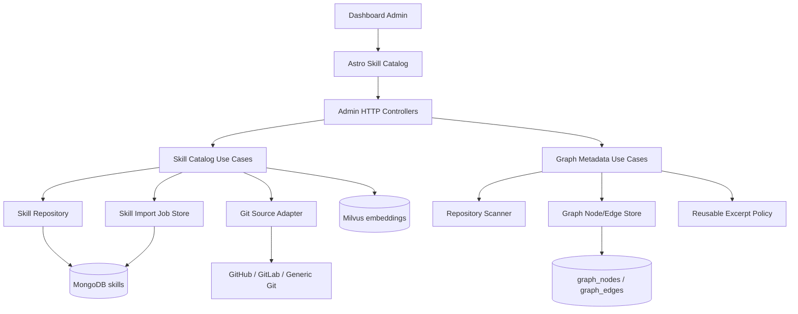
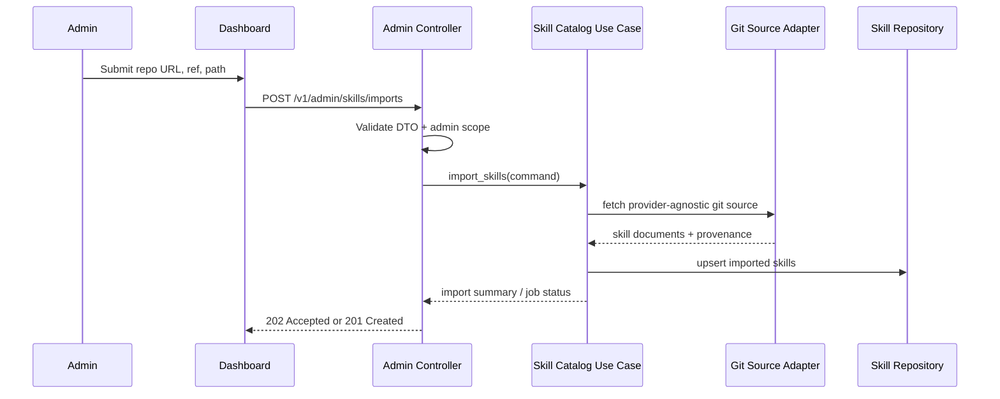
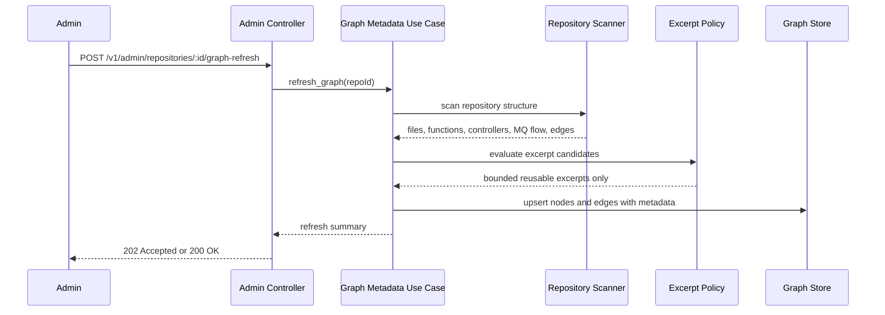

# Design: Skill Catalog Dashboard and Metadata-Only Graph Intelligence

Canonical system reference:

- [System Design](../../docs/system-design.md)

**Date**: 2026-04-15
**Status**: Proposed
**Related requirements**: [`docs/requirements/skill_management_and_graph_metadata.md`](../../docs/requirements/skill_management_and_graph_metadata.md)

---

## Architecture Overview

This design promotes skills from a seed-time artifact into a first-class operator-managed catalog. Admins manage reusable skills through the Dashboard and admin APIs, while the backend keeps provenance, workflow-step labels, and quality metadata so skills remain auditable and reusable.

The same design also corrects the repository-intelligence direction for `GraphNode`. The graph path must remain metadata-first: files, functions, controllers, routes, message-queue producers/consumers, and dependency edges are the durable product asset. Full source code is not. Gemma 4 should reason over compact structural metadata plus a small set of curated excerpts when a fragment has long-lived instructional value.

This keeps Clean Architecture intact: Dashboard controllers stay in presentation, orchestration lives in application use cases, persistent contracts live in domain/data models, and Git-provider/graph-store details stay in infrastructure.

---

## Component Diagram



---

## Primary Data Flows

### Skill Import Flow



### Graph Metadata Refresh Flow



---

## API Contract

### Endpoints

| Method | Path                                       | Auth      | Status Codes            |
| ------ | ------------------------------------------ | --------- | ----------------------- |
| GET    | `/v1/admin/skills`                         | Admin JWT | 200, 401, 403           |
| POST   | `/v1/admin/skills`                         | Admin JWT | 201, 400, 401, 403, 409 |
| GET    | `/v1/admin/skills/:id`                     | Admin JWT | 200, 401, 403, 404      |
| PATCH  | `/v1/admin/skills/:id`                     | Admin JWT | 200, 400, 401, 403, 404 |
| DELETE | `/v1/admin/skills/:id`                     | Admin JWT | 204, 401, 403, 404      |
| POST   | `/v1/admin/skills/imports`                 | Admin JWT | 202, 400, 401, 403      |
| GET    | `/v1/admin/skills/imports/:job_id`         | Admin JWT | 200, 401, 403, 404      |
| POST   | `/v1/admin/repositories/:id/graph-refresh` | Admin JWT | 202, 401, 403, 404      |
| GET    | `/v1/admin/repositories/:id/graph`         | Admin JWT | 200, 401, 403, 404      |

### Request / Response DTOs

```typescript
interface SkillSourceDto {
  provider: "github" | "gitlab" | "generic_git";
  repo_url: string;
  ref?: string;
  path: string;
  commit_sha?: string | null;
}

interface SkillDto {
  id: string;
  title: string;
  content: string;
  language: string;
  tags: string[];
  workflow_steps: string[];
  quality_score: number;
  source: SkillSourceDto | null;
  excerpt_kind: "none" | "reusable_excerpt";
  created_at: string;
  updated_at: string;
}

interface CreateSkillDto {
  title: string;
  content: string;
  language: string;
  tags?: string[];
  workflow_steps?: string[];
}

interface ImportSkillsDto {
  provider: "github" | "gitlab" | "generic_git";
  repo_url: string;
  ref?: string;
  path: string;
  auth_secret_ref?: string;
}

interface GraphNodeSummaryDto {
  id: string;
  node_type:
    | "repository"
    | "file"
    | "function"
    | "controller"
    | "route"
    | "mq_topic"
    | "mq_producer"
    | "mq_consumer";
  name: string;
  metadata: Record<string, unknown>;
}
```

### Error Responses

| Code                        | HTTP | Trigger                                                                   |
| --------------------------- | ---- | ------------------------------------------------------------------------- |
| `VAL_INVALID_GIT_URL`       | 400  | Unsupported or malformed repository URL                                   |
| `VAL_INVALID_SKILL_PAYLOAD` | 400  | Missing required title/content/language or invalid workflow-step metadata |
| `AUTH_UNAUTHORIZED`         | 401  | Missing or expired admin session                                          |
| `AUTH_FORBIDDEN`            | 403  | Principal lacks admin role                                                |
| `BIZ_SKILL_NOT_FOUND`       | 404  | Requested skill does not exist in tenant scope                            |
| `BIZ_SKILL_DUPLICATE`       | 409  | Manual create/import would create a conflicting skill identity            |
| `INF_GIT_FETCH_FAILED`      | 502  | Remote git fetch or clone failed                                          |
| `INF_GRAPH_REFRESH_FAILED`  | 500  | Graph metadata extraction failed                                          |

---

## Database Schema

### MongoDB: `skills`

```json
{
  "_id": "uuid",
  "company_id": "string",
  "title": "string",
  "content": "string",
  "language": "string",
  "tags": ["string"],
  "workflow_steps": ["string"],
  "quality_score": 0.0,
  "usage_count": 0,
  "source": {
    "provider": "github | gitlab | generic_git",
    "repo_url": "string",
    "ref": "string",
    "path": "string",
    "commit_sha": "string|null"
  },
  "excerpt_kind": "none | reusable_excerpt",
  "created_at": "timestamp",
  "updated_at": "timestamp"
}
```

Recommended indexes:

- `{ company_id: 1, title: 1 }`
- `{ company_id: 1, language: 1 }`
- `{ company_id: 1, "source.repo_url": 1, "source.path": 1 }`

### MongoDB: `skill_import_jobs`

```json
{
  "_id": "uuid",
  "company_id": "string",
  "provider": "github | gitlab | generic_git",
  "repo_url": "string",
  "ref": "string",
  "path": "string",
  "status": "pending | running | completed | failed",
  "imported_count": 0,
  "error_message": null,
  "created_at": "timestamp",
  "updated_at": "timestamp"
}
```

### Graph Store: `graph_nodes`

```sql
CREATE TABLE graph_nodes (
    id            UUID PRIMARY KEY,
    node_type     VARCHAR NOT NULL,
    name          VARCHAR NOT NULL,
    metadata      JSONB NOT NULL,
    created_at    TIMESTAMPTZ NOT NULL DEFAULT NOW(),
    UNIQUE (node_type, name)
);
```

Metadata expectations by node type:

- `file`: path, language, repo_id, import_count, exported_symbols
- `function`: file_path, signature, line_start, line_end, docstring_summary
- `controller`: framework, route_prefix, handler_names
- `route`: method, path, controller_name
- `mq_topic`: broker, topic_name, schema_hint
- `mq_producer` / `mq_consumer`: topic_name, service_name, handler_name

Full file contents are explicitly excluded from this schema.

---

## Domain Events

| Event                      | Published By            | Consumed By           | Payload                                     |
| -------------------------- | ----------------------- | --------------------- | ------------------------------------------- |
| `skill.imported`           | Skill Import Use Case   | Audit / observability | `{skillId, companyId, provider, repoUrl}`   |
| `skill.updated`            | Skill Catalog Use Case  | Audit / observability | `{skillId, companyId}`                      |
| `graph.metadata_refreshed` | Graph Metadata Use Case | Audit / observability | `{repoId, companyId, nodeCount, edgeCount}` |

---

## Security Considerations

- `company_id` is derived from the authenticated admin context, never from request body.
- Import credentials for private repositories should be referenced indirectly through stored secrets, not echoed back to clients.
- Imported content must be validated and bounded before persistence.
- Graph refresh endpoints must not expose raw source dumps through API payloads.

---

## Architecture Decision Records

### ADR-001: Use Provider-Agnostic Git Import for Skills

**Status**: Accepted  
**Date**: 2026-04-15

**Context**: Skill import is currently documented as a GitHub-specific seeding path, but operators may keep curated skills in GitHub, GitLab, or another Git service.

**Decision**: Model remote skill import as a provider-agnostic Git capability with provider metadata for UX and auth policy.

**Rationale**: The product concern is reusable skill content. Git hosting vendor is an integration detail.

**Consequences**:

- Positive: one contract supports GitHub, GitLab, and self-hosted Git.
- Negative: auth and source validation become slightly more complex.

**Alternatives Considered**:

| Option                 | Reason Rejected                                                        |
| ---------------------- | ---------------------------------------------------------------------- |
| GitHub-only import     | Too narrow and creates avoidable product lock-in                       |
| Local-path-only import | Requires server access and does not satisfy Dashboard-first operations |

### ADR-002: Keep GraphNode Metadata-First

**Status**: Accepted  
**Date**: 2026-04-15

**Context**: Using Gemma 4 to analyze full source bodies for graph construction is expensive, noisy, and unnecessary for structural topology.

**Decision**: Persist graph nodes and edges as metadata-first structures, with optional bounded reusable excerpts only when they have durable instructional value.

**Rationale**: Structural retrieval quality comes from topology and semantic labels, not from indiscriminately storing entire files.

**Consequences**:

- Positive: lower token cost, smaller storage footprint, cleaner graph context for reasoning.
- Negative: some deep implementation detail is no longer immediately available from graph payload alone.

**Alternatives Considered**:

| Option                               | Reason Rejected                                                 |
| ------------------------------------ | --------------------------------------------------------------- |
| Store full source in every GraphNode | Too expensive, noisy, and not durable as a graph representation |
| Never store any excerpt              | Too rigid for high-value long-lived patterns and contracts      |

### ADR-003: Run Remote Skill Import as an Auditable Admin Operation

**Status**: Accepted  
**Date**: 2026-04-15

**Context**: Remote import may take longer than a typical CRUD action and needs provenance, retry, and operator visibility.

**Decision**: Treat remote import as a tracked admin operation with import-job records, rather than an opaque fire-and-forget side effect.

**Rationale**: Admin UX, observability, and troubleshooting all improve when import work is explicit and auditable.

**Consequences**:

- Positive: better operator visibility and easier retry/error handling.
- Negative: introduces an extra job-status concept and storage surface.

**Alternatives Considered**:

| Option                        | Reason Rejected                                                |
| ----------------------------- | -------------------------------------------------------------- |
| Fully synchronous import only | Brittle for larger repositories and poor for operator feedback |
| Script-only import            | Does not satisfy Dashboard-managed product requirements        |
