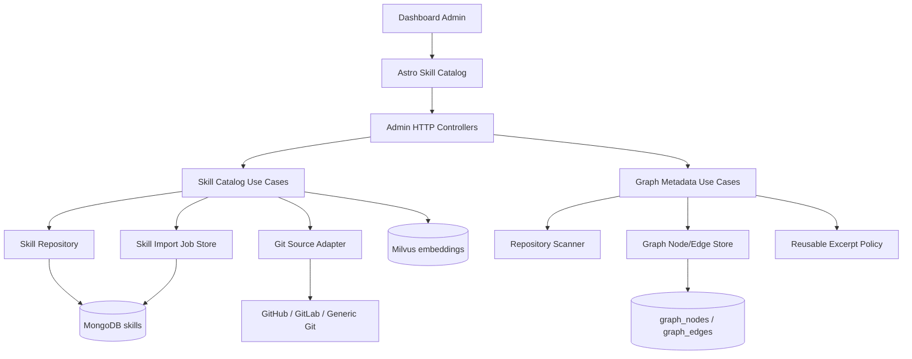

# Feature: Skill Catalog and Metadata-Only Graph Intelligence

**Status**: In Progress (Phase 5)
**Date**: 2026-04-15

---

## Goal

Add first-class skill lifecycle management to the product and correct the current graph-analysis direction so repository intelligence remains efficient at scale.

This feature must:
- Let admins import reusable skills from external Git repositories (GitHub, GitLab, etc.)
- Let admins create, read, update, and delete skills directly in the Dashboard
- Keep the skill model workflow-aware (tagged, curated, and reused by step)
- Change `GraphNode` handling from source-heavy ingestion to metadata-first ingestion
- Avoid sending full source files into LLMs for graph analysis by default

---

## Architecture Overview

This design promotes skills from a seed-time artifact into a first-class operator-managed catalog. Admins manage reusable skills through the Dashboard and admin APIs, while the backend keeps provenance, workflow-step labels, and quality metadata so skills remain auditable and reusable.

The graph path remains metadata-first: files, functions, controllers, routes, message-queue producers/consumers, and dependency edges are the durable product asset. Full source code is not.

### Component Diagram

---

## User Stories

### Story 1: Import Skills From External Git Repositories
**As a** Platform Admin  
**I want to** import skill packs from GitHub, GitLab, or another Git repository through the Dashboard  
**So that** skill onboarding does not depend on server-side scripts or direct filesystem access.

### Story 2: Manage Skills Directly in the Dashboard
**As a** Platform Admin  
**I want to** create, edit, review, list, and delete skills in the Dashboard  
**So that** reusable guidance can be curated as a product asset rather than a hidden seed artifact.

### Story 3: Keep GraphNode Metadata-First
**As an** ML / RAG Engineer  
**I want** graph construction to store structural metadata instead of full source code  
**So that** Gemma 3/4 is not forced to analyze large low-signal payloads for topology extraction.

---

## API Contract

| Method | Path                                       | Auth      | Status Codes            |
| ------ | ------------------------------------------ | --------- | ----------------------- |
| GET    | `/v1/admin/skills`                         | Admin JWT | 200, 401, 403           |
| POST   | `/v1/admin/skills`                         | Admin JWT | 201, 400, 401, 403, 409 |
| GET    | `/v1/admin/skills/:id`                     | Admin JWT | 200, 401, 403, 404      |
| PATCH  | `/v1/admin/skills/:id`                     | Admin JWT | 200, 400, 401, 403, 404 |
| DELETE | `/v1/admin/skills/:id`                     | Admin JWT | 204, 401, 403, 404      |
| POST   | `/v1/admin/skills/imports`                 | Admin JWT | 202, 400, 401, 403      |
| GET    | `/v1/admin/skills/imports/:job_id`         | Admin JWT | 200, 401, 403, 404      |
| POST   | `/v1/admin/repositories/:id/graph-refresh` | Admin JWT | 202, 401, 403, 404      |
| GET    | `/v1/admin/repositories/:id/graph`         | Admin JWT | 200, 401, 403, 404      |

---

## Database Schema

### MongoDB: `skills`
Stores the curated skill content and provenance.

### Graph Store: `graph_nodes`
Persists metadata-rich nodes and edges. Full file contents are explicitly excluded.

---

## Integration Points

- `src/dashboard/`: New skill catalog pages and import workflows.
- `src/minder/presentation/http/admin/`: New admin endpoints for skill CRUD and graph summaries.
- `src/minder/application/admin/`: Use cases for validation and job status.
- `src/minder/models/skill.py`: Skill model with provenance and workflow metadata.
- `src/minder/models/graph.py`: GraphNode metadata prioritizing structure.
- `src/minder/tools/ingest.py`: Foundation for provider-agnostic remote import.
- `src/minder/tools/repo_scanner.py`: Metadata-rich node extraction.
