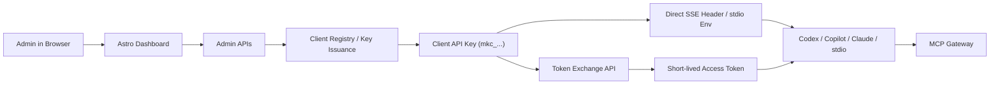

# Admin and Client Onboarding Guide

This guide covers the current onboarding flow for Minder on local Docker.

## Onboarding Architecture



## Current Reality

Today you can:

- create an admin
- sign into `/dashboard/login` in the browser with the admin API key
- create MCP clients
- generate client API keys
- exchange a client key for an access token
- onboard `Codex`, `Copilot-style MCP clients`, and `Claude Desktop`
- authenticate SSE and stdio clients directly with the client API key

Today you cannot yet:

- manage broader workflow, repository, and observability screens from the dashboard

The current admin bootstrap is still API-key based, but the operator experience is now browser-first:
- fresh deployment: `/dashboard/setup`
- returning admin: `/dashboard/login`
- active browser session: `/dashboard`

If the admin API key is lost later, recover it with:

```bash
docker compose -f docker/docker-compose.dev.yml exec minder \
  uv run python scripts/reset_admin_api_key.py \
  --username admin
```

## 1. Create the admin user

If this is a fresh deployment, open:

- [http://localhost:8800/dashboard/setup](http://localhost:8800/dashboard/setup)

Complete the setup form and save the returned admin API key:

```text
mk_...
```

## 2. Sign into the browser dashboard

Open:

- [http://localhost:8800/dashboard/login](http://localhost:8800/dashboard/login)

Enter the admin API key:

```text
mk_...
```

After successful sign-in, the browser is redirected to:

- [http://localhost:8800/dashboard](http://localhost:8800/dashboard)

The dashboard session is stored in an `HttpOnly` cookie.

## 3. Use the admin session or admin JWT against admin routes

For browser-based dashboard use, the login cookie is enough.

For API clients like `curl`, Postman, or Bruno, bearer auth is still useful.

If you need an admin JWT through MCP, the current codebase still exposes `minder_auth_login`.

Recommended split:
- browser dashboard: cookie session
- scripted admin API calls: bearer token
- MCP clients: direct `mkc_...` client API key or token exchange

## 4. Create an MCP client

This step is now browser-native from the dashboard and backed by the same JSON APIs that external automation can call.

Open:

- [http://localhost:8800/dashboard](http://localhost:8800/dashboard)

Use the `Create Client` form to submit:
- name
- slug
- description
- tool scopes from the multi-select dropdown
- repo scopes from the multi-select dropdown
- optional custom repo scope paths in the extra input

Quick UX notes:
- use preset buttons like `Query Only`, `Read Only`, or `Full Dev Assistant` to prefill `Tool Scopes`
- use `All Repos (*)` when the client should not be limited to one repository
- use `Custom Repo Scopes` when the path you need is not already listed

After submission, the Astro dashboard reveals the new `mkc_...` client API key exactly once.

Save it before leaving that page.

The same capability remains available through the admin API if you need scripted provisioning.

Example:

```bash
curl -X POST http://localhost:8800/v1/admin/clients \
  -H "Content-Type: application/json" \
  -H "Authorization: Bearer <jwt>" \
  -d '{
    "name": "Codex Local",
    "slug": "codex-local",
    "description": "Local Codex workstation",
    "tool_scopes": ["minder_query", "minder_search_code", "minder_search_errors"],
    "repo_scopes": ["*"]
  }'
```

The response includes:

- client metadata
- a newly issued `client_api_key` starting with `mkc_`

Save the `mkc_...` value. That is what MCP clients should use.

## 5. Get onboarding templates for the client

Run:

```bash
curl http://localhost:8800/v1/admin/onboarding/<client_id> \
  -H "Authorization: Bearer <jwt>"
```

This returns templates for:

- `codex`
- `copilot`
- `claude_desktop`

All templates now default to:

```text
http://localhost:8800/sse
```

## 6. Choose a client auth mode

Minder now supports two first-class client auth modes.

### Option A: Direct client key auth

Use this when the MCP client can send either:
- `X-Minder-Client-Key: mkc_...` over `SSE`
- `MINDER_CLIENT_API_KEY=mkc_...` for `stdio`

This is the lowest-friction path and is the default recommendation for local integrations.

### Option B: Token exchange

Use this when the client prefers short-lived bearer tokens or already has a token bootstrap flow.

## 7. Exchange a client API key for an access token

Run:

```bash
curl -X POST http://localhost:8800/v1/auth/token-exchange \
  -H "Content-Type: application/json" \
  -d '{
    "client_api_key": "mkc_..."
  }'
```

Expected response:

```json
{
  "access_token": "<token>",
  "token_type": "bearer",
  "expires_in": 3600,
  "client": {
    "slug": "codex-local"
  }
}
```

## 8. Connect an MCP client

### Codex-style bootstrap payload

```json
{
  "server_url": "http://localhost:8800/sse",
  "client_api_key": "mkc_...",
  "bootstrap_path": "/v1/auth/token-exchange",
  "client_slug": "codex-local",
  "preferred_tool": "minder_query"
}
```

### Copilot-style MCP snippet

```json
{
  "type": "mcp",
  "url": "http://localhost:8800/sse",
  "headers": {
    "X-Minder-Client-Key": "mkc_..."
  },
  "client": "codex-local"
}
```

### Claude Desktop-style snippet

```json
{
  "mcpServers": {
    "minder": {
      "url": "http://localhost:8800/sse",
      "headers": {
        "X-Minder-Client-Key": "mkc_..."
      },
      "client": "codex-local"
    }
  }
}
```

### Stdio client bootstrap

For stdio-based local integrations, export:

```bash
export MINDER_CLIENT_API_KEY="mkc_..."
```

Then start the stdio transport with:

```bash
MINDER_SERVER__TRANSPORT=stdio UV_CACHE_DIR=.uv-cache uv run python -m minder.server
```

Protected tool calls will resolve the client principal from `MINDER_CLIENT_API_KEY` without calling `/v1/auth/token-exchange` first.

## 9. Open the dashboard

The dashboard is at:

- [http://localhost:8800/dashboard](http://localhost:8800/dashboard)

If you already signed in at `/dashboard/login`, the dashboard opens with the browser session cookie.

From the dashboard today you can:
- create a client
- open a client detail page
- issue a new client key
- revoke all client keys for that client
- run a connection test
- inspect onboarding snippets and recent client activity
- read onboarding snippets for Codex, Copilot-style MCP, and Claude Desktop
- run a browser-based connection test by pasting a client API key
- inspect recent activity for that client from audit events

## 10. Revoke a client key

If a client key is leaked or rotated, open the client detail page in the dashboard and use the revoke action. The same capability also remains available on the admin API.

After revocation:
- SSE direct auth with the old `mkc_...` key fails
- stdio direct auth with the old `mkc_...` key fails
- token exchange with the old `mkc_...` key fails

## Recommended Operator Flow

1. Start the Docker stack.
2. Create the first admin.
3. Sign in to `/dashboard/login`.
4. Create one client per real MCP consumer from the dashboard.
5. Scope each client to the smallest needed tool set.
6. Prefer direct client-key auth for local `SSE` and `stdio` integrations.
7. Use onboarding templates from the admin API, not handwritten config.
8. Rotate or revoke client keys when a workstation or integration changes ownership.
