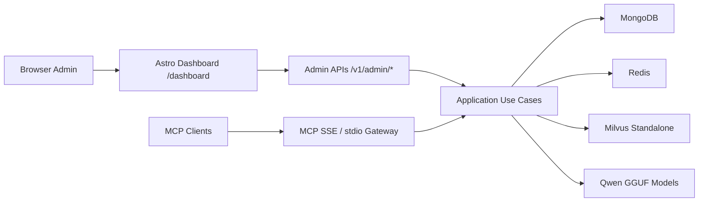

# Local Setup Guide

This guide gets a fresh Minder stack running locally on port `8800`, including browser admin bootstrap and MCP connectivity checks.

## Local Architecture



## Prerequisites

- Docker Desktop or compatible Docker runtime
- `uv`
- enough disk for MongoDB, Redis, Milvus, and GGUF model files

## 1. Download the local models

Run:

```bash
./scripts/download_models.sh
```

This script stores models in:

```text
~/.minder/models
```

Expected files:

```text
~/.minder/models/qwen3-embedding-0.6b.Q8_0.gguf
~/.minder/models/qwen3.5-0.8b-instruct.Q4_K_M.gguf
```

## 2. Start the Docker stack

Run:

```bash
docker compose -f docker/docker-compose.dev.yml up --build
```

The stack exposes:

- Minder SSE: [http://localhost:8800/sse](http://localhost:8800/sse)
- Minder admin login: [http://localhost:8800/dashboard/login](http://localhost:8800/dashboard/login)
- Dashboard: [http://localhost:8800/dashboard](http://localhost:8800/dashboard)
- MongoDB: `localhost:27017`
- Redis: `localhost:6379`
- Milvus: `localhost:19530`

Wait until all services are healthy and `docker-minder-1` is started.

Recommended check:

```bash
docker compose -f docker/docker-compose.dev.yml ps
```

## 3. Open the first-run setup page

On a fresh deployment with no admin users, open:

- [http://localhost:8800/dashboard/setup](http://localhost:8800/dashboard/setup)

Fill in:

- email
- username
- display name

On success, Minder redirects to a setup-complete page and reveals the bootstrap admin API key once.

Save the `mk_...` value before leaving that page.

If an admin already exists, `/dashboard/setup` is no longer the right entrypoint and you should use `/dashboard/login` instead.

## 4. Sign in to the dashboard

Open:

- [http://localhost:8800/dashboard/login](http://localhost:8800/dashboard/login)

Paste the `mk_...` admin API key from the setup-complete page.

On success, the browser is redirected to:

- [http://localhost:8800/dashboard](http://localhost:8800/dashboard)

The dashboard session is stored in an `HttpOnly` cookie.

## 5. Verify the SSE server is up

Run:

```bash
curl -N http://localhost:8800/sse
```

Expected output starts like this:

```text
event: endpoint
data: /messages/?session_id=...
```

If you see that, the MCP SSE server is reachable.

## 6. Verify the direct stdio bootstrap path

For local stdio-based MCP clients, export a client key and start Minder in stdio mode:

```bash
export MINDER_CLIENT_API_KEY="mkc_..."
MINDER_SERVER__TRANSPORT=stdio UV_CACHE_DIR=.uv-cache uv run python -m minder.server
```

Protected tool calls can now resolve the client principal directly from `MINDER_CLIENT_API_KEY` without a token-exchange pre-step.

## 7. Move to onboarding

Continue with:

- [Admin and Client Onboarding Guide](/Users/trungtran/ai-agents/minder/docs/guides/admin-client-onboarding.md)

## Route Map

- `/dashboard/setup`: first-run admin bootstrap
- `/dashboard/login`: admin browser login
- `/dashboard/clients`: Astro client registry and detail shell
- `/v1/admin/*`: admin JSON APIs used by the dashboard
- `/v1/auth/token-exchange`: client key to bearer token exchange
- `/sse`: MCP SSE entrypoint

## Troubleshooting

### Models are missing

Check:

```bash
ls ~/.minder/models
```

### Minder container cannot boot

Check:

```bash
docker compose -f docker/docker-compose.dev.yml logs minder
```

### I lost the first admin API key

Run:

```bash
docker compose -f docker/docker-compose.dev.yml exec minder \
  uv run python scripts/reset_admin_api_key.py \
  --username admin
```

The command rotates the admin API key and prints the new `mk_...` value once.

### I need to verify browser onboarding again

Open these routes in order:

- [http://localhost:8800/dashboard/setup](http://localhost:8800/dashboard/setup)
- [http://localhost:8800/dashboard/login](http://localhost:8800/dashboard/login)
- [http://localhost:8800/dashboard](http://localhost:8800/dashboard)

### SSE does not respond

Check:

```bash
curl http://localhost:8800/sse
```

and confirm the container is running:

```bash
docker compose -f docker/docker-compose.dev.yml ps
```
