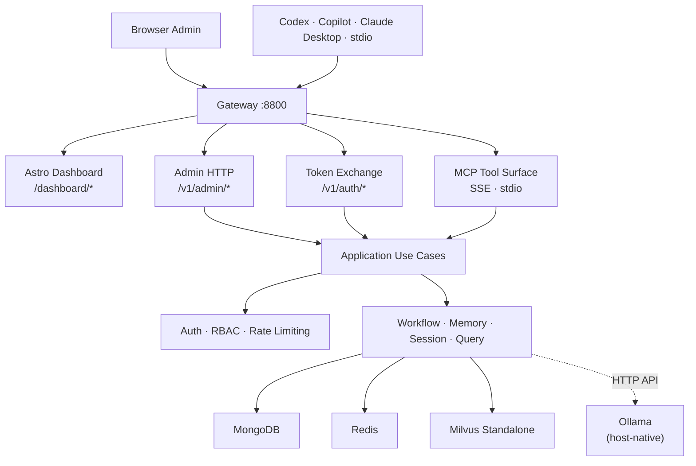

# Minder Server

Minder is a self-hosted MCP platform for repository-aware engineering intelligence. It provides semantic retrieval, workflow governance, and persistent memory for AI agents.

## Architecture

Minder uses **Ollama** as its AI inference backend. Ollama runs natively on the host machine, providing hardware-accelerated inference (Metal on Mac, CUDA on Linux) while Minder runs in Docker containers.



### Why Ollama instead of in-process inference?

| Aspect            | In-process (Ollama-python)      | Ollama (current)       |
| ----------------- | ------------------------------- | ---------------------- |
| Docker build time | 30+ min (ARM emulation)         | ~2 min                 |
| Multi-platform    | ❌ Frequent build failures      | ✅ amd64 + arm64       |
| GPU acceleration  | Manual CMake flags              | Automatic (Metal/CUDA) |
| Image size        | ~3 GB                           | ~500 MB                |
| Model management  | Mount GGUF files into container | `ollama pull` on host  |

### Runtime Layers

```text
Presentation   -> src/minder/presentation/http/admin   (HTTP routes, DTOs)
                 src/dashboard                         (Astro admin console)
Application    -> src/minder/application/admin         (use cases)
Domain         -> src/minder/models                    (entities, value objects)
Infrastructure -> src/minder/store                     (MongoDB, Milvus, Redis)
                 src/minder/auth                       (principals, middleware)
                 src/minder/llm                        (Ollama HTTP client)
                 src/minder/embedding                  (Ollama embedding client)
```

---

## Quick Start

### Requirements

- Docker with the Compose plugin
- `curl`

---

### 1) Automatic Installation (Recommended)

```bash
# Install Ollama + models + Minder (auto-detects OS)
curl -fsSL https://raw.githubusercontent.com/hiimtrung/minder/main/scripts/release/install-minder-release.sh | bash
```

### 2) Manual Installation

#### 1) Install Ollama

The install script does this automatically, but you can also install manually:

| OS      | Command                                                              |
| ------- | -------------------------------------------------------------------- |
| macOS   | `brew install ollama` or [download app](https://ollama.com/download) |
| Linux   | `curl -fsSL https://ollama.com/install.sh \| sh`                     |
| Windows | `winget install Ollama.Ollama`                                       |

#### 2) Pull models

```bash
ollama pull gemma4:e2b
ollama pull embeddinggemma
```

#### 3) Start infra and Minder

```bash
docker compose -f docker/docker-compose.yml up -d
```

#### 4) Bootstrap admin

Open [http://localhost:8800/dashboard/setup](http://localhost:8800/dashboard/setup).

---

### 3) Server Management

#### Update

```bash
# Auto-detect latest version and update:
curl -fsSL https://raw.githubusercontent.com/hiimtrung/minder/main/scripts/release/update-minder.sh | bash

# Update to a specific version:
curl -fsSL https://raw.githubusercontent.com/hiimtrung/minder/main/scripts/release/update-minder.sh | bash -s -- --tag v0.3.0
```

#### Uninstall

```bash
# Keep Ollama, models, and data volumes (re-run install to refresh):
curl -fsSL https://raw.githubusercontent.com/hiimtrung/minder/main/scripts/release/uninstall-minder.sh | bash -s -- --keep-data

# Full removal of all Minder components:
curl -fsSL https://raw.githubusercontent.com/hiimtrung/minder/main/scripts/release/uninstall-minder.sh | bash

---

## Configuration

| Variable | Default | Purpose |
| --- | --- | --- |
| `MINDER_SERVER__PORT` | `8800` | HTTP listen port |
| `MINDER_LLM__OLLAMA_URL` | `http://localhost:11434` | Ollama API endpoint |
| `MINDER_LLM__OLLAMA_MODEL` | `gemma4:e2b` | LLM model name |
| `MINDER_EMBEDDING__OLLAMA_URL` | `http://localhost:11434` | Ollama embedding endpoint |
| `MINDER_EMBEDDING__OLLAMA_MODEL` | `embeddinggemma` | Embedding model name |
| `MINDER_MONGODB__URI` | `mongodb://localhost:27017` | MongoDB URI |
| `MINDER_REDIS__URI` | `redis://localhost:6379/0` | Redis URI |
| `MINDER_VECTOR_STORE__URI` | `http://localhost:19530` | Milvus endpoint |

---

## Server Management Scripts

| Script | Description |
| --- | --- |
| `install-minder-release.sh` | Install Ollama + models + Minder (auto-detects OS) |
| `install-minder-release.ps1` | Windows PowerShell equivalent |
| `update-minder.sh` | Update to latest or specific version |
| `uninstall-minder.sh` | Uninstall with `--keep-data` option |

---

## Documentation

- [Development Workflow](guides/development.md)
- [Local Setup Guide](guides/local-setup.md)
- [Admin & Client Onboarding](guides/admin-client-onboarding.md)
- [Production Deployment](guides/production-deployment.md)
- [System Design](system-design.md)
```
