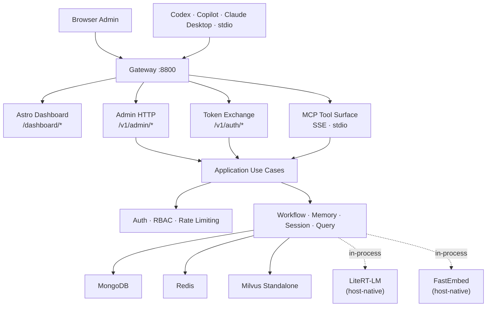

# Minder Server

Minder is a self-hosted MCP platform for repository-aware engineering intelligence. It provides semantic retrieval, workflow governance, and persistent memory for AI agents.

## Architecture

Minder uses a **split AI inference** architecture:

- **LLM inference**: [LiteRT-LM](https://github.com/google-ai-edge/LiteRT-LM) runs natively on the host for high-performance text generation with hardware acceleration (Metal on Mac, CPU elsewhere).
- **Embedding inference**: [FastEmbed](https://qdrant.github.io/fastembed/) runs natively in-process for embedding generation via ONNX runtime, without external container dependencies.



### Why local inference?

| Aspect            | LiteRT-LM (LLM)               | FastEmbed (Embedding)          |
| ----------------- | ------------------------------ | ------------------------------ |
| Deployment        | Host-native, in-process        | Host-native, in-process        |
| Hardware acceleration | Automatic (Metal/CPU)          | ONNX Runtime (CPU)             |
| Model format      | `.litertlm` optimized          | ONNX                           |
| Cold start        | Engine init ~3s                | ONNX init <1s                  |
| Model management  | Download `.litertlm` file      | Auto-download & cache          |
| Performance       | No HTTP overhead, direct API   | No HTTP overhead, direct API   |

The zero-dependency in-process architecture ensures low latency and reduces the operational burden of managing external inference containers.

### Runtime Layers

```text
Presentation   -> src/minder/presentation/http/admin   (HTTP routes, DTOs)
                 src/dashboard                         (Astro admin console)
Application    -> src/minder/application/admin         (use cases)
Domain         -> src/minder/models                    (entities, value objects)
Infrastructure -> src/minder/store                     (MongoDB, Milvus, Redis)
                 src/minder/auth                       (principals, middleware)
                 src/minder/llm                        (LiteRT-LM + OpenAI fallback)
                 src/minder/embedding                  (FastEmbed ONNX client)
```

---

## Quick Start

### Requirements

- Docker with the Compose plugin
- `curl`

---

### 1) Automatic Installation (Recommended)

```bash
# Install LiteRT-LM model + Minder (auto-detects OS)
curl -fsSL https://raw.githubusercontent.com/hiimtrung/minder/main/scripts/release/install-minder-release.sh | bash
```

### 2) Manual Installation

#### 1) Download LiteRT-LM model

```bash
mkdir -p ~/.minder/models
curl -L "https://huggingface.co/litert-community/gemma-4-E4B-it-litert-lm/resolve/main/gemma-4-E4B-it.litertlm?download=true" \
  -o ~/.minder/models/gemma-4-E4B-it.litertlm
```

#### 2) Start infra and Minder

```bash
docker compose -f docker/docker-compose.yml up -d
```

The FastEmbed provider automatically downloads and caches the embedding model (`mixedbread-ai/mxbai-embed-large-v1`) on the first run.

#### 3) Bootstrap admin

Open [http://localhost:8800/dashboard/setup](http://localhost:8800/dashboard/setup).

---

### 3) Server Management

#### Update

```bash
# Auto-detect latest version and update:
curl -fsSL https://raw.githubusercontent.com/hiimtrung/minder/main/scripts/release/update-minder.sh | bash

# Update to a specific version:
curl -fsSL https://raw.githubusercontent.com/hiimtrung/minder/main/scripts/release/update-minder.sh | bash -s -- --tag v0.3.0
```

#### Uninstall

```bash
# Keep data volumes (re-run install to refresh):
curl -fsSL https://raw.githubusercontent.com/hiimtrung/minder/main/scripts/release/uninstall-minder.sh | bash -s -- --keep-data

# Full removal of all Minder components:
curl -fsSL https://raw.githubusercontent.com/hiimtrung/minder/main/scripts/release/uninstall-minder.sh | bash
```

---

## Configuration

| Variable | Default | Purpose |
| --- | --- | --- |
| `MINDER_SERVER__PORT` | `8800` | HTTP listen port |
| `MINDER_LLM__PROVIDER` | `litert` | LLM provider (`litert` / `openai`) |
| `MINDER_LLM__LITERT_MODEL_PATH` | `~/.minder/models/gemma-4-E4B-it.litertlm` | LiteRT-LM model file |
| `MINDER_LLM__LITERT_BACKEND` | `cpu` | LiteRT hardware backend |
| `MINDER_LLM__LITERT_CACHE_DIR` | `~/.minder/cache/litert` | Compiled artifact cache |
| `MINDER_EMBEDDING__PROVIDER` | `fastembed` | Embedding provider (`fastembed` / `openai`) |
| `MINDER_EMBEDDING__FASTEMBED_MODEL` | `mixedbread-ai/mxbai-embed-large-v1` | FastEmbed model name |
| `MINDER_EMBEDDING__FASTEMBED_CACHE_DIR` | `~/.minder/cache/fastembed` | FastEmbed cache dir |
| `MINDER_EMBEDDING__DIMENSIONS` | `1024` | Embedding vector dimensions |
| `MINDER_MONGODB__URI` | `mongodb://localhost:27017` | MongoDB URI |
| `MINDER_REDIS__URI` | `redis://localhost:6379/0` | Redis URI |
| `MINDER_VECTOR_STORE__URI` | `http://localhost:19530` | Milvus endpoint |

---

## Server Management Scripts

| Script | Description |
| --- | --- |
| `install-minder-release.sh` | Download LiteRT-LM model + start Minder stack |
| `install-minder-release.ps1` | Windows PowerShell equivalent |
| `update-minder.sh` | Update to latest or specific version |
| `uninstall-minder.sh` | Uninstall with `--keep-data` option |

---

## Documentation

- [Development Workflow](guides/development.md)
- [Local Setup Guide](guides/local-setup.md)
- [Admin & Client Onboarding](guides/admin-client-onboarding.md)
- [Production Deployment](guides/production-deployment.md)
- [System Design](system-design.md)
