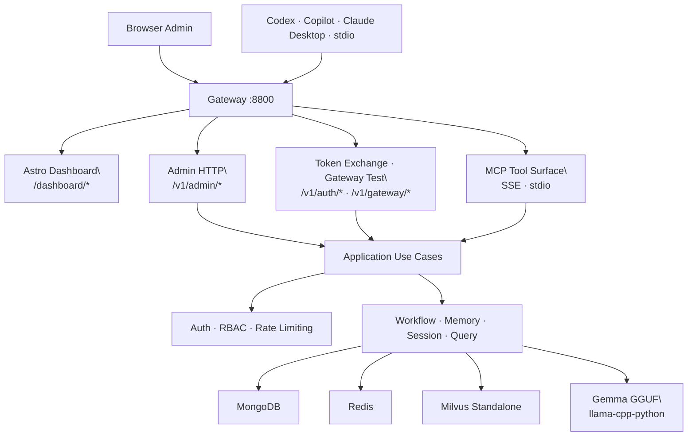

# Minder Server

Minder is an AI MCP server platform for managing your LLM flow development and memory of AI agents. It provides repository-aware retrieval, workflow governance, and persistent memory.

## Why Minder

- **Repository-aware retrieval**: Search across code, docs, and historical errors.
- **Workflow governance**: Keep delivery phases explicit and auditable.
- **Persistent memory**: Session context for long-running engineering tasks.
- **Built-in admin dashboard**: API-first client onboarding and registry.
- **Protocol Flexibility**: Supports both `SSE` and `stdio`.

---

## Quick Start (Local Setup)

### 1) Download GGUF models

```bash
./scripts/download_models.sh
```
Models are saved to `~/.minder/models`.

### 2) Prepare environment

```bash
cp .env.example .env
cp src/dashboard/.env.example src/dashboard/.env
```

### 3) Start infra services

```bash
docker compose -f docker/docker-compose.local.yml up -d
```
This starts MongoDB, Redis, Milvus Standalone (plus etcd + MinIO).

### 4) Run backend

```bash
PYTHONPATH=src uv run python -m minder.server
```

### 5) Run dashboard (dev mode)

```bash
cd src/dashboard
bun install
bun run dev
```

### 6) Bootstrap first admin

Open [http://localhost:8800/dashboard/setup](http://localhost:8800/dashboard/setup) and create the first admin.
Save the bootstrap API key (`mk_...`) immediately.

### 7) Sign in

Open [http://localhost:8800/dashboard/login](http://localhost:8800/dashboard/login) and authenticate with the `mk_...` key.

---

## System Architecture



### Clean Runtime Layers

```text
Presentation   -> src/minder/presentation/http/admin   (HTTP routes, DTOs)
                 src/dashboard                         (Astro admin console)
Application    -> src/minder/application/admin         (use cases)
Domain         -> src/minder/models                    (entities, value objects)
Infrastructure -> src/minder/store                     (MongoDB, Milvus, Redis adapters)
                 src/minder/auth                       (principals, middleware, rate limiter)
                 src/minder/graph                      (LangGraph pipeline, nodes)
```

---

## Configuration

Minder loads config from `minder.toml` and `MINDER_` environment variables.

| Variable | Default | Purpose |
| --- | --- | --- |
| `MINDER_SERVER__PORT` | `8800` | HTTP listen port |
| `MINDER_MONGODB__URI` | `mongodb://localhost:27017` | MongoDB URI |
| `MINDER_REDIS__URI` | `redis://localhost:6379/0` | Redis URI |
| `MINDER_VECTOR_STORE__URI` | `http://localhost:19530` | Milvus endpoint |

---

## Operator Playbooks

### Onboard an MCP client

1. Open **Client Registry** in dashboard.
2. Create client and save the issued key (`mkc_...`).
3. Use the key via `X-Minder-Client-Key` header (SSE) or `MINDER_CLIENT_API_KEY` env var (stdio).

### Recover admin access

```bash
PYTHONPATH=src uv run python scripts/reset_admin_api_key.py --username <admin-username>
```

### Production deployment

```bash
docker compose -f docker/docker-compose.yml up -d
```

---

## Documentation Index

- [Development Workflow](guides/development.md)
- [Local Setup Guide](guides/local-setup.md)
- [Admin & Client Onboarding](guides/admin-client-onboarding.md)
- [Production Deployment](guides/production-deployment.md)
- [System Design](system-design.md)
