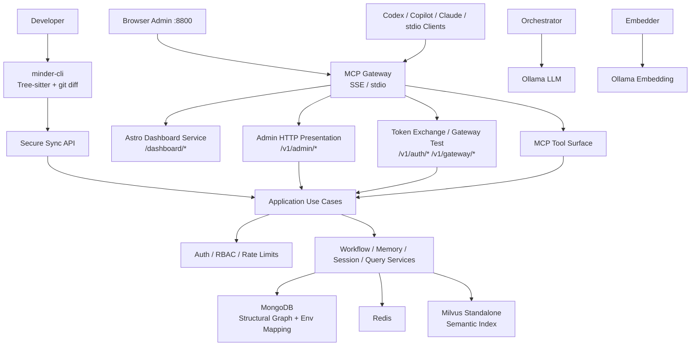
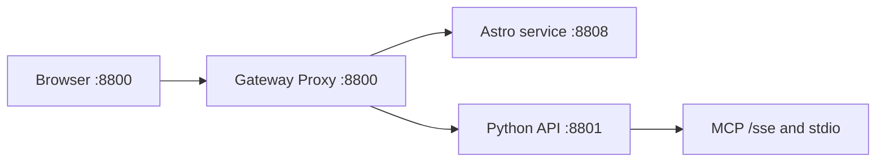
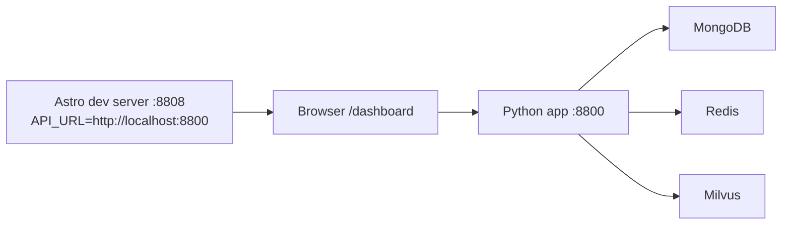
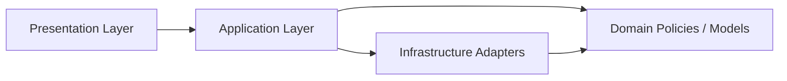
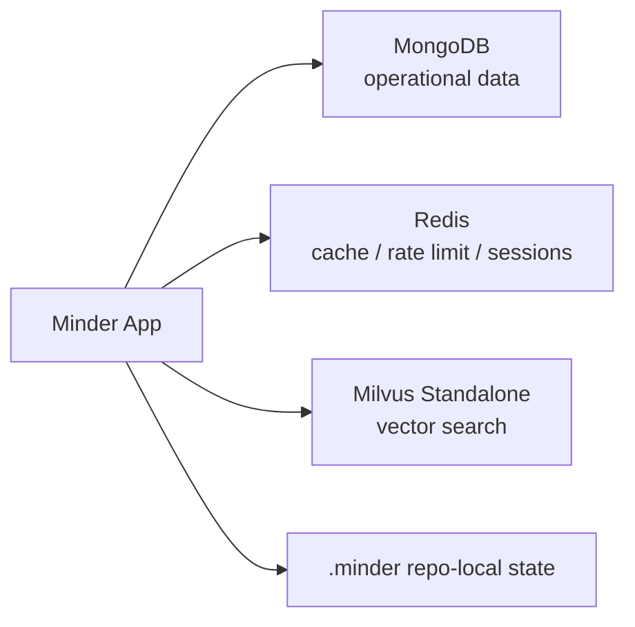
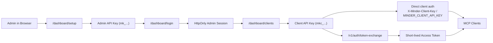
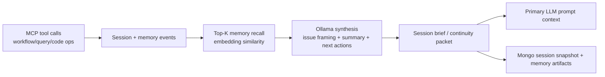
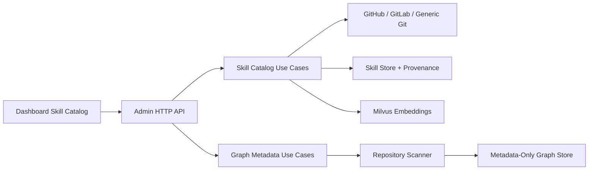
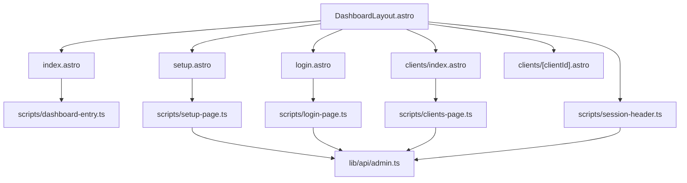

# System Design

This document is the canonical system-design reference for Minder.

Use it for:

- overall architecture
- runtime and deployment shape
- clean architecture boundaries
- storage and retrieval topology
- dashboard and MCP integration flow
- links to deeper feature-specific design documents

## 1. System Overview

Minder is an MCP-first engineering assistant platform with:

- a PyPI-distributed `minder-cli` edge extractor for fast metadata sync
- an Astro admin console
- a provider-aware skill catalog with Dashboard-driven curation
- an MCP gateway over `SSE` and `stdio`
- admin APIs for onboarding and client management
- repository-aware retrieval, workflow, memory, and session tools
- operational data in `MongoDB`
- cache, rate limiting, and client sessions in `Redis`
- vector search in `Milvus Standalone`
- LLM and Embedding inference via host-native Ollama (Gemma 3/4)

## 2. Runtime Architecture

### Review Note

Gemma 3/4 remains the reasoning model for orchestration and synthesis. The semantic index should continue to use a dedicated embedding model instead of treating Gemma 3/4 as the primary vector generator.

## 3. Dashboard Runtime Modes

Minder supports two dashboard runtime modes.

### Containerized Production: Reverse-Proxy Split Runtime

The Astro console runs as a separate service in production, but the browser still sees a single public origin on port `8800`.

The deployment model is:

At runtime:

- the gateway is the only public port binder on `8800`
- Astro owns all `/dashboard/*` routes directly
- the Python API owns `/v1/*`, `/sse`, `/messages/*`, `/setup`, and related backend routes
- same-origin browser behavior is preserved through reverse proxying

### Local Frontend Development: Split Runtime

For local frontend work, Astro can run separately from Minder:

In this mode:

- Astro dev server runs on `8808`
- Minder backend stays on `8800`
- dashboard API calls go to `API_URL`
- Astro maps `API_URL` into the client-visible `PUBLIC_API_URL` during dev/build
- onboarding snippets use the backend origin seen on the API request, which makes local snippets point to `8800`
- when `dashboard.dev_server_url` is configured, backend dashboard routes redirect to the Astro dev server instead of serving compatibility static files

### Compatibility Static Serving

Backend-served static dashboard assets still exist as a compatibility/testing mode, but this is no longer the recommended production deployment shape.

## 4. Clean Architecture Boundaries

### Presentation

- [`src/minder/presentation/http/admin/routes.py`](../src/minder/presentation/http/admin/routes.py)
- [`src/minder/presentation/http/admin/api.py`](../src/minder/presentation/http/admin/api.py)
- [`src/minder/presentation/http/admin/dashboard.py`](../src/minder/presentation/http/admin/dashboard.py)
- [`src/minder/presentation/http/admin/context.py`](../src/minder/presentation/http/admin/context.py)

`routes.py` still exists because it is the composition boundary for the admin HTTP presentation layer.
It no longer owns old Python-rendered dashboard HTML.

Responsibilities are now split as:

- `routes.py`: route composition only
- `api.py`: JSON admin APIs
- `dashboard.py`: compatibility static dashboard serving and redirect policy
- `context.py`: shared request/auth/use-case context

### Application

- [`src/minder/application/admin/use_cases.py`](../src/minder/application/admin/use_cases.py)
- [`src/minder/application/admin/dto.py`](../src/minder/application/admin/dto.py)

### Infrastructure

- [`src/minder/store`](../src/minder/store)
- [`src/minder/auth`](../src/minder/auth)
- [`src/minder/transport`](../src/minder/transport)

## 5. Storage Topology

### MongoDB

Primary operational store for:

- users
- clients
- API key metadata
- audit events
- workflow-adjacent application records

### Redis

Used for:

- client session caching
- admin/session support
- rate limiting
- ephemeral cache

### Milvus

Used for:

- embeddings
- semantic retrieval
- vector-backed repository/document search

### Knowledge Graph Store

Used for:

- repository structure and dependency topology
- metadata for files, functions, controllers, routes, and message-queue flow
- durable graph edges such as `imports`, `calls`, `depends_on`, `publishes`, and `consumes`

Policy:

- graph storage is metadata-first
- full source code is not stored in `GraphNode` payloads by default
- optional code excerpts are allowed only for durable, reusable snippets with long-term value

### Edge Extraction Direction

The next optimization path moves structural extraction closer to the repository:

- a standalone `minder-cli` uses Tree-sitter parsers to extract metadata from changed files
- `git diff` drives delta-based refresh so the system avoids broad reprocessing when only a small set of files changed
- the CLI pushes structural JSON to the server through a secure sync API
- the server remains the source of truth for graph persistence, semantic indexing, orchestration, and dashboard delivery

## 6. Admin and Client Auth Flow

## 7. Dashboard Integration Rules

The dashboard is not a blind static site. Python still controls route state.

Current behavior for compatibility mode:

- backend-served `/dashboard` routes can still redirect between setup/login/clients
- static assets under `/dashboard/_astro/...` bypass those redirects

Containerized production behavior:

- the gateway routes `/dashboard` and `/dashboard/*` to the Astro service
- Astro resolves `/dashboard` state through `GET /v1/admin/bootstrap-state`
- browser API calls stay same-origin through the gateway

Onboarding snippets and connection-test templates derive their base URL like this:

- local split-runtime mode: from the backend API request origin, which follows `API_URL`
- Docker and production static mode: from the current request origin on the same host

## 8. Context Continuity Layer (Memory + Session Intelligence)

Minder now treats memory/session as a context continuity subsystem, not only a CRUD surface.

Primary objective:

- keep long-running engineering flows coherent across many tool calls
- reduce primary LLM context-window drift on large tasks
- summarize and compact high-signal context for later reuse

### Layered Design

### Responsibilities

- `minder_memory_*` remains the durable memory primitive:
  - store entries with embeddings
  - retrieve candidate context by semantic similarity
- `minder_session_*` remains the session state primitive:
  - persist active state, context, and working set
  - restore progress deterministically
- Ollama acts as a context synthesizer:
  - convert raw recalled items into concise issue-centric summaries
  - highlight unresolved blockers, decisions, and assumptions
  - suggest next valid actions aligned with workflow state

### Workflow Instruction Compiler (Strict Mode)

When a repository has an active workflow, Minder must compile and enforce a deterministic instruction envelope before any primary LLM generation.

Compiled instruction envelope:

- `workflow_id`, `workflow_version`
- `current_step`, `next_step`, `blocked_by`
- `required_artifacts` and completion criteria
- `forbidden_actions` (step-skip, invalid artifact mutation, out-of-scope operations)
- `allowed_tools` for current step
- `output_contract` expected from the primary LLM

Enforcement policy:

- the primary LLM prompt must always include this envelope
- conflicting free-form suggestions are treated as invalid
- guardrails reject outputs that violate step constraints
- workflow instruction has higher priority than conversational context

### Workflow-Linked Context Retrieval

Memory, session, and skill retrieval must be workflow-step aware.

Required behavior:

- `minder_memory_recall` filters/ranks by `current_step` compatibility first, then semantic similarity
- `minder_session_restore` returns both raw state and step-specific continuity brief
- skill retrieval (new `minder_skill_*` surface) prioritizes skills tagged for the active step/artifact type
- Ollama synthesizes a step-scoped brief for the primary LLM, not a generic summary

This ensures the primary LLM remains aligned with implementation phase and does not drift across large contexts.

### Continuity Packet Contract

The continuity payload injected into primary LLM prompts should include:

- `problem_summary`: what is being solved now
- `progress_summary`: what has been completed
- `open_questions`: unresolved technical/product questions
- `risk_flags`: likely failure points or missing evidence
- `next_actions`: ordered, workflow-compatible next steps
- `source_refs`: memory/session artifact IDs for auditability

This packet is regenerated per major step transition and on explicit restore calls.

## 9. Skill Registry and Graph Metadata Policy

Skill management is an operator-facing product capability, not only a bootstrap script path.

Required architecture direction:

- the Dashboard exposes skill list, create, update, delete, and remote import flows
- remote import supports GitHub, GitLab, and generic Git repositories through a provider-agnostic contract
- imported skills retain provenance metadata such as provider, repo URL, ref, and source path
- skill retrieval remains workflow-step aware

Graph intelligence follows a metadata-first contract:

- `GraphNode` persists structural metadata for files, functions, controllers, routes, message topics, producers, and consumers
- repository scanning should extract signatures, paths, route patterns, topic names, and dependency relationships without storing full source bodies
- when a code fragment is truly worth keeping, store only a bounded reusable excerpt rather than the whole source file

Planned performance direction for graph refresh:

- replace slow server-centric graph refresh with a repo-local CLI extractor and secure sync API
- parse only changed files by default through `git diff`
- preserve full reindex as an explicit fallback operation, not the normal path

## 10. Frontend Structure

Key paths:

- [`src/dashboard/src/layouts/DashboardLayout.astro`](../src/dashboard/src/layouts/DashboardLayout.astro)
- [`src/dashboard/src/pages/setup.astro`](../src/dashboard/src/pages/setup.astro)
- [`src/dashboard/src/pages/login.astro`](../src/dashboard/src/pages/login.astro)
- [`src/dashboard/src/pages/index.astro`](../src/dashboard/src/pages/index.astro)
- [`src/dashboard/src/pages/clients/index.astro`](../src/dashboard/src/pages/clients/index.astro)
- [`src/dashboard/src/pages/clients/[clientId].astro`](../src/dashboard/src/pages/clients/[clientId].astro)
- [`src/dashboard/src/scripts/dashboard-entry.ts`](../src/dashboard/src/scripts/dashboard-entry.ts)
- [`src/dashboard/src/scripts/clients-page.ts`](../src/dashboard/src/scripts/clients-page.ts)
- [`src/dashboard/src/lib/api/admin.ts`](../src/dashboard/src/lib/api/admin.ts)

## 11. Deployment Shape

### Local / Dev

- [`docker/docker-compose.local.yml`](../docker/docker-compose.local.yml)
- infra-only Docker services for MongoDB, Redis, Milvus, etcd, and minio
- Minder and Astro run outside Docker for interactive debugging

### Production

- [`docker/docker-compose.yml`](../docker/docker-compose.yml)
- [`docker/Dockerfile.api`](../docker/Dockerfile.api)
- [`docker/Dockerfile.dashboard`](../docker/Dockerfile.dashboard)
- [`docker/Caddyfile`](../docker/Caddyfile)
- services:
  - `gateway` on public `8800`
  - `dashboard` on internal `8808`
  - `minder-api` on internal `8801`

## 12. Related Design Documents

Feature-specific design docs still exist and remain useful, but this file is the system-level source of truth.

- [Gateway Auth and Dashboard Design](../docs/design/mcp-gateway-auth-dashboard.md)
- [Phase 4.3 Console Clean Architecture and UI Modernization](../docs/design/p4_3_console_clean_architecture_and_ui_modernization.md)
- [Production Dashboard Reverse Proxy Split](../docs/design/production_dashboard_reverse_proxy_split.md)
- [Skill Catalog Dashboard and Metadata-Only Graph Intelligence](../docs/design/skill_management_and_graph_metadata.md)
- [CLI Edge Extractor and Graph Sync Architecture](../docs/design/cli_edge_extractor_and_graph_sync_architecture.md)
- [Plan 02: Architecture](../docs/plan/02-architecture.md)
