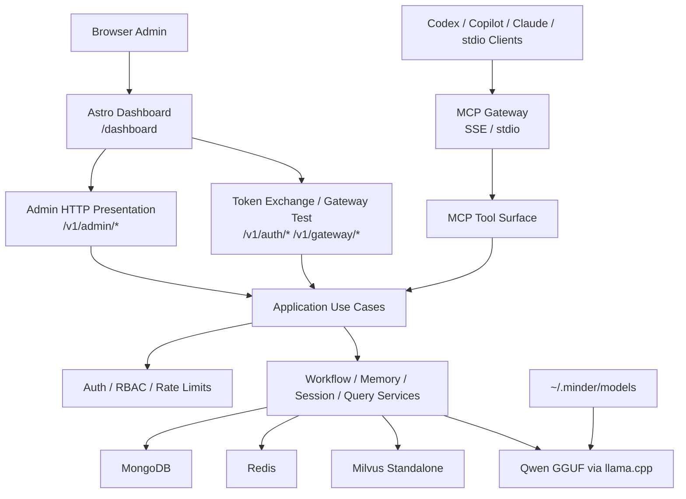
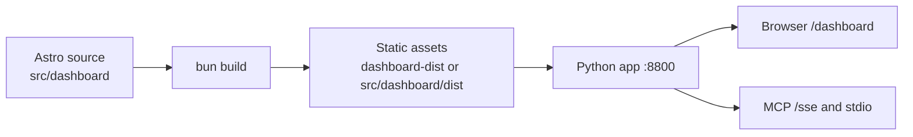
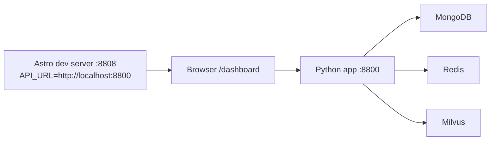
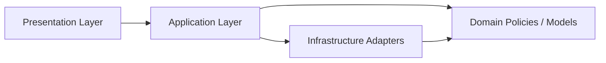
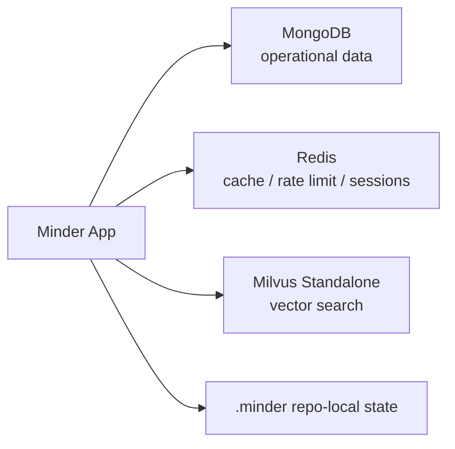
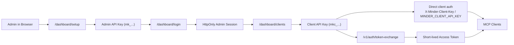
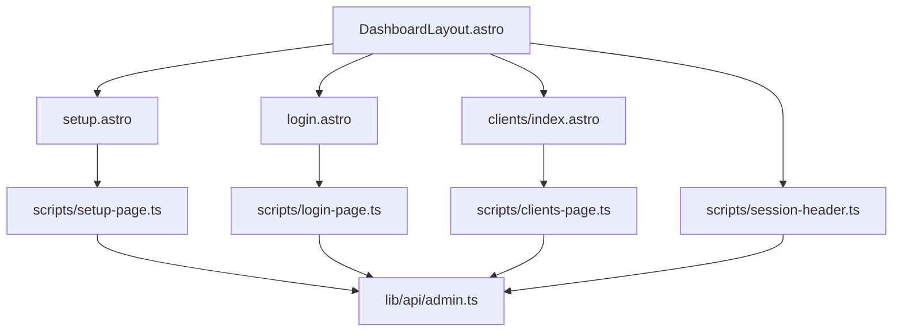

# System Design

This document is the canonical system-design reference for Minder.

Use it for:

- overall architecture
- runtime and deployment shape
- clean architecture boundaries
- storage and retrieval topology
- dashboard and MCP integration flow
- links to deeper feature-specific design documents

## 1. System Overview

Minder is an MCP-first engineering assistant platform with:

- an Astro admin console
- an MCP gateway over `SSE` and `stdio`
- admin APIs for onboarding and client management
- repository-aware retrieval, workflow, memory, and session tools
- operational data in `MongoDB`
- cache, rate limiting, and client sessions in `Redis`
- vector search in `Milvus Standalone`
- local GGUF inference through `llama-cpp-python`

## 2. Runtime Architecture

## 3. Dashboard Runtime Modes

Minder supports two dashboard runtime modes.

### Docker and Production: Same-Origin Static Serving

The Astro console does not run as a separate runtime in Docker or production.

The deployment model is:

At runtime:

- Astro is already built
- Python is the only server binding port `8800`
- Python serves the static dashboard assets and all admin/MCP APIs on the same origin

### Local Frontend Development: Split Runtime

For local frontend work, Astro can run separately from Minder:

In this mode:

- Astro dev server runs on `8808`
- Minder backend stays on `8800`
- dashboard API calls go to `API_URL`
- Astro maps `API_URL` into the client-visible `PUBLIC_API_URL` during dev/build
- onboarding snippets use the backend origin seen on the API request, which makes local snippets point to `8800`
- when `dashboard.dev_server_url` is configured, backend dashboard routes redirect to the Astro dev server instead of serving static files

## 4. Clean Architecture Boundaries

### Presentation

- [`src/minder/presentation/http/admin/routes.py`](../src/minder/presentation/http/admin/routes.py)
- [`src/minder/presentation/http/admin/api.py`](../src/minder/presentation/http/admin/api.py)
- [`src/minder/presentation/http/admin/dashboard.py`](../src/minder/presentation/http/admin/dashboard.py)
- [`src/minder/presentation/http/admin/context.py`](../src/minder/presentation/http/admin/context.py)

`routes.py` still exists because it is the composition boundary for the admin HTTP presentation layer.
It no longer owns old Python-rendered dashboard HTML.

Responsibilities are now split as:

- `routes.py`: route composition only
- `api.py`: JSON admin APIs
- `dashboard.py`: Astro/static dashboard serving and redirect policy
- `context.py`: shared request/auth/use-case context

### Application

- [`src/minder/application/admin/use_cases.py`](../src/minder/application/admin/use_cases.py)
- [`src/minder/application/admin/dto.py`](../src/minder/application/admin/dto.py)

### Infrastructure

- [`src/minder/store`](../src/minder/store)
- [`src/minder/auth`](../src/minder/auth)
- [`src/minder/transport`](../src/minder/transport)

## 5. Storage Topology

### MongoDB

Primary operational store for:

- users
- clients
- API key metadata
- audit events
- workflow-adjacent application records

### Redis

Used for:

- client session caching
- admin/session support
- rate limiting
- ephemeral cache

### Milvus

Used for:

- embeddings
- semantic retrieval
- vector-backed repository/document search

## 6. Admin and Client Auth Flow

## 7. Dashboard Integration Rules

The dashboard is not a blind static site. Python still controls route state.

Current behavior:

- no admin exists:
  - `/dashboard` -> `/dashboard/setup`
- admin exists but no valid session:
  - `/dashboard` -> `/dashboard/login`
- valid admin session exists:
  - `/dashboard` -> `/dashboard/clients`
- static assets under `/dashboard/_astro/...` bypass those redirects

Onboarding snippets and connection-test templates derive their base URL like this:

- local split-runtime mode: from the backend API request origin, which follows `API_URL`
- Docker and production static mode: from the current request origin on the same host

## 8. Frontend Structure

Key paths:

- [`src/dashboard/src/layouts/DashboardLayout.astro`](../src/dashboard/src/layouts/DashboardLayout.astro)
- [`src/dashboard/src/pages/setup.astro`](../src/dashboard/src/pages/setup.astro)
- [`src/dashboard/src/pages/login.astro`](../src/dashboard/src/pages/login.astro)
- [`src/dashboard/src/pages/clients/index.astro`](../src/dashboard/src/pages/clients/index.astro)
- [`src/dashboard/src/scripts/clients-page.ts`](../src/dashboard/src/scripts/clients-page.ts)
- [`src/dashboard/src/lib/api/admin.ts`](../src/dashboard/src/lib/api/admin.ts)

## 9. Deployment Shape

### Local / Dev

- [`docker/docker-compose.dev.yml`](../docker/docker-compose.dev.yml)
- one app port: `8800`
- Docker services for Minder, MongoDB, Redis, Milvus, etcd, minio

### Production

- [`docker/docker-compose.prod.yml`](../docker/docker-compose.prod.yml)
- multi-stage build:
  - `bun` builds Astro
  - `python` serves built assets and APIs

## 10. Related Design Documents

Feature-specific design docs still exist and remain useful, but this file is the system-level source of truth.

- [Gateway Auth and Dashboard Design](../docs/design/mcp-gateway-auth-dashboard.md)
- [Phase 4.3 Console Clean Architecture and UI Modernization](../docs/design/p4_3_console_clean_architecture_and_ui_modernization.md)
- [Plan 02: Architecture](../docs/plan/02-architecture.md)
